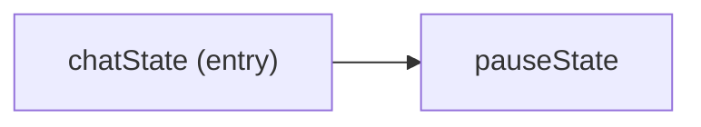

# Quick start

In this chapter you run a working chat bot and learn the *names* of its parts. Nothing is explained yet; Chapter 2 traces what happens when you send it a message, and Part II explains why.

## Run it

```bash
export OPENAI_TOKEN=sk-...
go run ./examples/quickstart
```

The program prints `[User Message]` and waits. Input is multi-line: type your message, then submit it with a line containing only `$` (a line containing only Ctrl-], then Enter, also works). The bot prints `[Assistant Response]`, its reply, and then `[User Message]` again. A session looks like this; the model's wording will differ from run to run:

```text
[User Message]

Hi, I'm Paul. What can you do?
$

[Assistant Response]

Hello! I'm an AI language model designed to assist you with a wide range of tasks. I can answer questions, provide information on various topics. (...) My capabilities include:

1. **Answering Questions**: I can provide detailed answers to factual inquiries, explain concepts, and clarify information.

2. **Providing Information**: I can summarize articles, provide overviews of topics, and offer insights into current events (up until October 2023).

3. **Assisting with Tasks**: I can help you with writing tasks, such as drafting emails, essays, or reports, and can assist in creating lists, schedules, or plans.

4. **Offering Suggestions**: Whether you're looking for book recommendations, travel tips, or ideas for a project, I can provide tailored suggestions.

5. **Learning Support**: I can help clarify educational concepts, provide study tips, and assist with language learning.

Feel free to ask me anything, and I'll do my best to assist you!

[User Message]

```

```admonish title="Bot ignored first message?"
Notice the reply never uses your name. Chapter 2 explains why.
```

Keep typing messages, each ended with a `$` line, for as long as you like.
(Ctrl-C quits; Ctrl-D doesn't — a sharp edge explained below.)

## The whole program

```go
{{#include ../../../examples/quickstart/main.go}}
```

## Naming the parts

That is the entire program. Read it top to bottom and you meet six calls. Each gets a name here and a chapter later; for now, attach the name and move on.

`arboreal.CreateBehaviorTree(name, description, example)` returns a **behavior tree**: an empty container for states, with a name, a description and an example request. The three strings are for the planner (Chapter 8), not for you. `chatBehavior` is the only tree in this program.

`arboreal.LLMCompletionState(arboreal.LLMCompletionOptions{})` returns a **state** that calls a language model with the messages it is handed and appends the reply. Empty options mean the default model, `gpt-4o-mini`, and no system prompt. In this run, that reply came from this state.

`arboreal.PauseState("Let user respond")` returns a state that does nothing but announce "I need the user to say something before this tree can continue."

`chatBehavior.AddTransition(&chatState, &pauseState)` adds an edge: after `chatState`, run `pauseState`. The first state ever added to a tree is its entry point, so this one line also makes `chatState` the start. There is no separate call to declare a start state and none to declare an end; the tree has one edge, and that edge says everything there is to say about its shape:



`arboreal.CreateTodoListExecutive(name, description, &chatBehavior)` returns the **executive**: the thing that owns the conversation, decides which trees to run for a request, and runs them; messages that arrive while a tree is waiting on the user go to that tree. Here it has exactly one tree to choose from.

`exec.RunLoop(ctx, arboreal.TerminalChannel{})` is the **run loop**: receive a message from a **channel** (here, the terminal), run the executive, send the reply back, repeat. `TerminalChannel` is what printed `[User Message]` and `[Assistant Response]`; those labels come from the channel, not from the executive or the model. The loop returns only on error — and `TerminalChannel` never produces one (the first sharp edge below), so `RunLoop` never returns, the closing `panic(err)` is never reached, and the only way out is Ctrl-C.

```admonish warning title="Sharp edge"
`TerminalChannel.Receive` in `channel.go` never returns an error — not even at end of input. If you press Ctrl-D, the loop receives an empty message, runs it through the executive (one model call), prints the reply, and prompts again. Ctrl-D does not end the session; quit with Ctrl-C.
```

```admonish warning title="Sharp edge"
`TerminalChannel.Receive` builds a new `bufio.Scanner` over stdin on every call, and the first scanner reads the whole pipe into its private buffer. So `printf 'hi\n$\nagain\n$\n' | go run ./examples/quickstart` delivers only the first message; the rest is lost with the discarded scanner. Worse, once the pipe is drained every later `Receive` returns an empty message instantly, so the loop spins, calling the model on each pass, until you kill it. Drive the terminal examples interactively.
```

```admonish title="Executive needed"
The executive is not optional, even with one tree. `RunLoop` is a method on `TodoListExecutive`; a bare `BehaviorTree` has no loop of its own. Chapter 7 shows the loop you would otherwise write by hand, and Chapter 8 explains what the executive adds on top of it.
```

```admonish title="Why the ampersands?"
For now, a rule to copy: states and trees are always wired by address — `&chatState`, `&pauseState`, `&chatBehavior`. Drop an ampersand and the compiler answers with `BehaviorState does not implement Behavior`; the fix is to put it back. Chapter 5 explains why.
```

## Coming from LangGraph

A rough first mapping, to be refined in Chapter 3. The behavior tree is roughly a `StateGraph`. The two states are roughly nodes, and `AddTransition` is roughly `add_edge`, with the first node added standing in for `START`. `PauseState` is roughly `interrupt()`: the point where the graph stops and control returns to the caller until the user supplies more input. The executive plus `RunLoop` is roughly the compiled graph's `invoke` called in a loop, with `TerminalChannel` playing the part of whatever code you would have written to read from the terminal and print the result.

The mapping breaks down in one place. Before a tree runs for the first time, the executive also *plans*: it reads your message and decides which of its trees to run. Later messages go straight to the tree that is waiting on the user. With one tree the choice is trivial, and in this chapter it is invisible, but the step happens all the same and has no LangGraph equivalent. Chapter 2 shows it happening; Chapter 8 explains it.

```admonish example title="Recap"
- A **behavior tree** is a container of **states** connected by transitions; the first state added is the entry point.
- The **executive** owns the conversation and runs the trees; `RunLoop` connects it to a **channel** such as the terminal.
```
