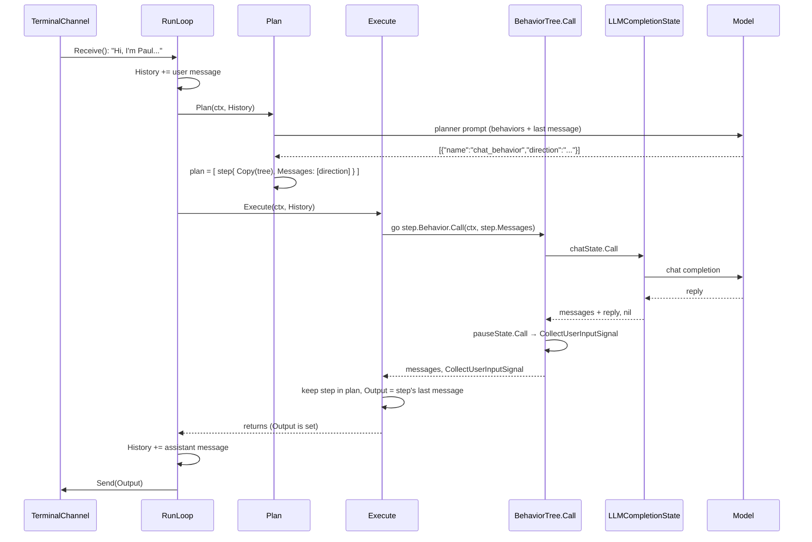

# Anatomy of one turn

In Chapter 1 you typed a message into the quickstart and got a reply. This chapter follows that one message down through every layer of Arboreal and back up. Along the way you will meet every identifier on the path of a turn, in the order it runs. Do not try to understand the internals yet. Part II does that, one layer per chapter, and each of those chapters ends with a section called "Back to the trace" that points at a numbered step on this page. This chapter names things and puts them in sequence, so that when Part II explains a piece you already know where it sits.

```admonish
One caveat before the dive: the trace below rides inside `RunLoop`, the receive-reply loop the quickstart uses, because that is the easiest place to watch a turn happen. But the loop is only a thin wrapper. The same seven steps can be driven one message at a time, with no loop and no terminal, through the executive's `Call` method — that is how Part III runs agents, and Chapter 9 reduces `RunLoop` to a few lines around it.
```

Read this chapter twice: now, and again after Chapter 8.

## The stack

```
RunLoop(ctx, channel)             executive.go   the turn loop
  └─ Plan(ctx, history)           executive.go   an LLM writes a todo list of behaviors
  └─ Execute(ctx, history)        executive.go   runs the steps, decides the reply
       └─ executePlan(ctx, plan)  executive.go   one goroutine per step
            └─ Behavior.Call(ctx, messages)
                 ├─ BehaviorTree.Call  behavior.go   stack-based walk over the states
                 └─ BehaviorState.Call state.go      one state: LLM call, pause, or Go
                      └─ ModelProvider.CreateChatCompletion   llm/
```

## One message, seven steps



### Step 1 — Receive

```go
func (e *TodoListExecutive) RunLoop(ctx context.Context, c Channel) error {
	for {
		cm, err := c.Receive()
		if err != nil {
			return err
		}
```

`RunLoop` in `executive.go` is a `for` loop with no exit condition. At the top of each pass it calls `Channel.Receive` and blocks. In the quickstart the channel is `TerminalChannel`, whose `Receive` prints `[User Message]`, reads lines from stdin until the lone `$`, and returns them joined as one `ChannelMessage`. That is where your `Hi, I'm Paul. What can you do?` entered the framework.

```go
func (e *TodoListExecutive) RunLoop(ctx context.Context, c Channel) error {
	for {
		cm, err := c.Receive()
		(...)
		e.History = AppendToMessages(e.History, llm.ChatCompletionMessage{
			Role:    llm.ChatMessageRoleUser,
			Content: cm.Content,
		})
```

Here and in the steps that follow, `(...)` elides code that is irrelevant or was already shown.

`RunLoop` wraps the content as a user-role message and appends it, with `AppendToMessages`, to `e.History`. `History` is the executive's own transcript: an `AnnotatedMessages` list that lives on the `TodoListExecutive` struct for the whole conversation. Nothing has been sent to a model yet. `History` holds one message, and the executive's `plan` is empty.

### Step 2 — Plan

Because `len(e.plan) == 0`, `RunLoop` calls `Plan(ctx, e.History)`:

```go
func (e *TodoListExecutive) RunLoop(ctx context.Context, c Channel) error {
	for {
		(...)

		if len(e.plan) == 0 {
			e.Plan(ctx, e.History)
		} else {
			(...)
		}
		(...)
```

This is the step Chapter 1 flagged as having no LangGraph equivalent. The executive does not route your message to a handler or start walking a fixed graph. It asks a language model to write a todo list: given the user's message and the behaviors this executive owns, decide which behaviors to run, in what order, and give each one a **direction** — a short brief, in the planner's own words, for what that behavior should accomplish. What comes back becomes the plan: one step per chosen behavior, each step holding a fresh `Copy()` of that behavior and a message list of its own that starts with the direction. Everything after this point works off the plan, not off your message.

The clearest description of what the planner is asked to do is the prompt itself — `executivePlannerPrompt` in `executive.go`:

```
{{ .Preamble }}

Your job is to plan a series of steps to accomplish a goal given to you by a user.
The steps available to you are the following:

Re-plan: If a plan requires further planning to be complete, end it with this step
{{ range .Behaviors }}{{ .BehaviorName }}: {{ .BehaviorDescription }}
{{ end }}

Return your response as a JSON array of one or more step names to execute in order to accomplish the user's goal.
Each step should consist of the name of the step, as well as extra "direction" or context to accomplish the step accurately given the user's request.
A simple example response could be:

[
   {
      "name": "{{ (index .Behaviors 0).BehaviorName }}",
      "direction": "{{ (index .Behaviors 0).Example }}"
   }
]
```

It is a Go `text/template`; the `{{ … }}` slots are filled in from the executive before the call. In the quickstart, `Preamble` is empty, the behavior list renders as the single line `chat_behavior: A conversational bot`, and the sample response's `direction` is `chatBehavior`'s `Example` string, `<insert user's input here>` — the only hint the planner ever gets about what a direction should contain. `Plan` appends a "Previous chat history:" section (up to three messages before the latest; empty on this first turn) and sends the whole thing to the model together with your latest message. The reply is the JSON array the prompt asked for: names and directions.

In the quickstart there is one behavior to choose from, and the planner returned one step: a fresh copy of `chatBehavior` whose message list holds a single user-role message, the planner's direction. How the reply travels back inside `Plan`, and where your original words are stashed along the way, run on machinery Part II introduces — annotations in Chapter 4, the planner line by line in Chapter 8.

This is also the answer to Chapter 1's teaser. The behavior never received `Hi, I'm Paul. What can you do?` as a message. It received whatever the planner wrote in the `direction` field; your words ride along only as hidden context pinned to that message, which nothing in the quickstart reads. Nothing in `executivePlannerPrompt` asks the planner to preserve the user's words, and nothing in `chatState`, which has empty options and therefore no system prompt, tells the model how to read a direction if it does. Whether your name survives depends on a paraphrase you did not write.

```admonish warning title="Sharp edge"
The behavior does not see what the user typed. It sees the planner's *direction* — a paraphrase written by the planning LLM. With no instructions the paraphrase can drift ("my name is Paul" can become a greeting addressed to Paul). The workaround, from `examples/snapshot-simple`, is a `Preamble` that tells the planner how to write directions: `When writing the "direction" for a step, restate the user's message faithfully in the third person, quoting it`. Chapter 8 covers the `Preamble`.
```

### Step 3 — Execute, fan out

Back in `RunLoop`, the next call is `Execute(ctx, e.History)`:

```go
func (e *TodoListExecutive) RunLoop(ctx context.Context, c Channel) error {
	for {
		(...)

		e.Execute(ctx, e.History)
		(...)
```

`Execute` hands `e.plan` to `executePlan` — the helper the stack at the top of this chapter listed as "one goroutine per step", and that is its whole job: for every step of the plan it starts a goroutine and, inside it, calls `step.Behavior.Call(ctx, step.Messages)`. The messages that come back are written to `step.Messages`, and next to them lands the step's **signal** — the second value every behavior call returns, saying how the run ended. `executePlan` waits for all the goroutines, then hands `Execute` one result per step: the step, its messages, its signal.

Two things about this fan-out matter. Steps run concurrently: had the planner produced three steps, three trees would be running at once. And each step runs on its own `Copy()` of its behavior and its own message list; no step sees another step's messages, and none sees `History` directly. `Execute` then triages the results by the signal each step returned. In the quickstart there is one step, one goroutine, and one result.

### Step 4 — The tree walks its states

Inside the goroutine, `step.Behavior` is a `*BehaviorTree`, so the call lands in `BehaviorTree.Call` in `behavior.go`:

```go
func (b *BehaviorTree) Call(ctx context.Context, history AnnotatedMessages) (AnnotatedMessages, Signal) {
	(...)
	if b.State.IsEmpty() {
		b.State.Push(b.Graph.Initial())
		b.Traversed = make(map[string]bool)
	}

	var sig Signal

	for !b.State.IsEmpty() {
		state := b.State.Pop()

		if !b.Traversed[state.Hash()] {
			b.Traversed[state.Hash()] = true

			history, sig = state.Call(ctx, history)
			(...)
			children := b.Graph.Children(state)
			(...)
			for i := len(children) - 1; i >= 0; i-- {
				child := children[i]
				if !b.Traversed[child.Hash()] {
					b.State.Push(child)
				}
			}
		}
	}
```

The tree walks its graph with an explicit stack, `State`, kept on the struct. The stack is empty on a fresh copy, so `Call` pushes `Graph.Initial()`, the first state ever added to the tree, and resets `Traversed`. In the quickstart that entry state is `chatState`. Then the loop begins: pop a state, call it, push its children that have not been visited yet.

`chatState` is the `LLMCompletionState` from Chapter 1. With empty options it sends the step's messages — role and content only; annotations never leave the process — to the default model, `gpt-4o-mini`, with no system prompt. At this moment the step's messages are exactly one user-role message: the planner's direction. The model's reply is appended to the list as an assistant-role message and the state returns a `nil` signal, meaning "done, carry on". The tree pushes `chatState`'s one child, `pauseState`, and pops it on the next iteration.

`pauseState` is `PauseState("Let user respond")`. It does not touch the messages; it returns a `CollectUserInputSignal`. The second `(...)` above hides a `switch` on the signal's type, and this is its interesting case:

```go
			switch sig.(type) {
			(...)
			case *CollectUserInputSignal:
				for _, child := range children {
					if !b.Traversed[child.Hash()] {
						b.State.Push(child)
					}
				}
				goto done
			}
```

`BehaviorTree.Call` handles the signal specially: it pushes the pause state's unvisited children, of which there are none, and stops walking without clearing the stack. The tree keeps whatever is on its stack and returns the messages and the signal upward. In the quickstart the stack it keeps is empty, which matters in step 7.

### Step 5 — Execute decides the reply

`Execute` receives one result, and its signal is a `*CollectUserInputSignal`. Its triage has three cases; any other signal is ignored and the step's output is lost. A `nil` signal means the step finished, and its last message becomes a summary. An `*ErrorSignal` becomes an "Error occurred" summary. A `*CollectUserInputSignal` means the step is waiting for the user, so `Execute` keeps the step in the new `plan`, and adds its last message to the summaries as well. *New* is literal: `Execute` builds a fresh plan every turn out of the paused steps alone and assigns it over the old one, so a finished step is not removed so much as never carried forward. A turn on which every step finishes leaves the plan empty — which is exactly what sends the next message back through `Plan` in step 2 instead of step 7's resume.

Then it decides the turn's `Output`. If the kept plan holds exactly one entry, `Execute` takes a shortcut: `e.Output` is that step's last message, the reply the model just wrote in `chatState`, with no further model call. That is what happened in your run. Otherwise `Execute` makes one more `LLMCompletionState` call, on your last message, with one of two system prompts: if steps are still pending, a prompt that folds the collected summaries into a single question or statement; if nothing is pending, a prompt built from the transcript and the collected summaries. Note the asymmetry, and its edge: a step that is the only one left paused speaks for itself, even if another step finished in the same turn, and that finished step's output is dropped. Chapter 8 covers these paths and the `Re-plan` step, which this chapter skips.

### Step 6 — Send

Control returns to `RunLoop`, which finishes the pass — this is the rest of the loop's body, down to its closing brace:

```go
func (e *TodoListExecutive) RunLoop(ctx context.Context, c Channel) error {
	for {
		(...)

		e.History = AppendToMessages(e.History, llm.ChatCompletionMessage{
			Role:    llm.ChatMessageRoleAssistant,
			Content: e.Output,
		})

		err = c.Send(&ChannelMessage{
			Id:      cm.Id,
			Content: e.Output,
		})
		if err != nil {
			return err
		}
	}
}
```

`RunLoop` appends `e.Output` to `History` as an assistant-role message, again with `AppendToMessages`, and calls `Channel.Send`. `TerminalChannel.Send` prints `[Assistant Response]`, a blank line, the content, and a blank line. `History` now holds two messages, `plan` holds one paused step, and the turn is over. `RunLoop` goes back to the top and blocks in `Receive`.

### Step 7 — The next turn

You type a second message. `RunLoop` appends it to `History` as before, but now `len(e.plan)` is one, not zero, and the branch Step 2 left elided takes its other arm:

```go
func (e *TodoListExecutive) RunLoop(ctx context.Context, c Channel) error {
	for {
		(...)

		if len(e.plan) == 0 {
			e.Plan(ctx, e.History)
		} else {
			for _, step := range e.plan {
				step.Messages = append(step.Messages, *e.History.LastMessage())
			}
		}

		e.Execute(ctx, e.History)
		(...)
```

`Plan` is skipped entirely. Instead `RunLoop` walks the pending steps and appends `e.History.LastMessage()`, your new message, to each step's own `Messages`. The paused step's list is now: the planner's direction, the model's first reply, and your second message. Then `Execute` runs again.

`executePlan` calls `step.Behavior.Call` on the same tree copy as last turn. Its stack is empty, because the pause state had no children to push, so `BehaviorTree.Call` starts over: it pushes `Graph.Initial()`, resets `Traversed`, and runs `chatState` again. This time `chatState` sends the whole three-message list to the model, so the model sees a conversation with a prior exchange in it, and its reply is appended as the fourth message. `pauseState` runs, returns `CollectUserInputSignal`, the step is kept, the single-step shortcut fires, and `Output` is the new reply. The pattern repeats for as long as you keep typing. That is the whole chat loop: plan once, then resume the paused step forever, on a message list that grows by two messages every turn.

```admonish warning title="Sharp edge"
There are two conversations. The executive's `History` is the transcript you would show a user: their messages and the executive's outputs. Each step's `Messages` is what the model actually sees: the planner's direction, the replies, and every later user message appended on resume. They are related but not identical, and when something looks wrong in a reply, the step's messages are the ones to inspect.
```

## Vocabulary

| Term | Meaning |
|---|---|
| **turn** | one pass through `RunLoop`: receive, (plan,) execute, send |
| **plan** | the list of steps the planner produced; empty means "plan afresh next turn" |
| **step** | a `Copy()` of one behavior plus its own message list |
| **direction** | the planner's free-text instruction for a step; the first message the behavior sees |
| **signal** | what a `Call` returns alongside the messages: `nil`, `Skip`, `Terminal`, `CollectUserInput`, or `Error` |
| **history** | the executive's transcript; distinct from a step's messages |
| **output** | the string the executive sends back for the turn |
| **pause / resume** | a step returning `CollectUserInputSignal` is kept in the plan; the next turn feeds it the user's reply instead of re-planning |

## Coming from LangGraph

In LangGraph, one `invoke` runs your compiled graph once, from `START` until it reaches `END` or hits an `interrupt()`. State persists between invocations because a checkpointer saves it, keyed by `thread_id`, and the next `invoke` on the same thread loads it back. An interrupted graph is continued with `Command(resume=...)`, and the value you pass becomes the return value of the `interrupt()` call inside the node.

In Arboreal the persistent object is the executive itself. `History` and `plan` are fields on the `TodoListExecutive` and simply stay there between turns; there is no checkpointer in the loop you ran and no thread id, because one executive is one conversation. `CollectUserInputSignal` is the interrupt: it stops the tree walk and travels up through `BehaviorTree.Call` and `executePlan` to `Execute`, which decides what to do with it. "Resume" has no dedicated API. It is the next `Execute`, run after `RunLoop` has appended the new user message to the paused step's `Messages`; the tree then runs again from its stack, which in the quickstart means from the entry state.

The piece with no LangGraph analogue is step 2. Before any graph runs, an LLM reads the message and chooses *which graph to run*, and how to phrase the request to it. With one behavior the choice is forced, but the call happens all the same, and its output, the direction, is what the graph actually receives. Chapter 3 works through the rest of the mapping.

```admonish example title="Recap"
- A turn is: receive → (plan if none pending) → execute → send.
- The planner produces steps: a behavior copy plus a message list that starts with the planner's **direction**, not the user's words.
- Steps run concurrently; the tree inside a step walks its states with a stack and stops at a pause.
- A paused step stays in the plan; the next turn resumes it rather than re-planning.
- `History` and a step's `Messages` are different lists.
```
