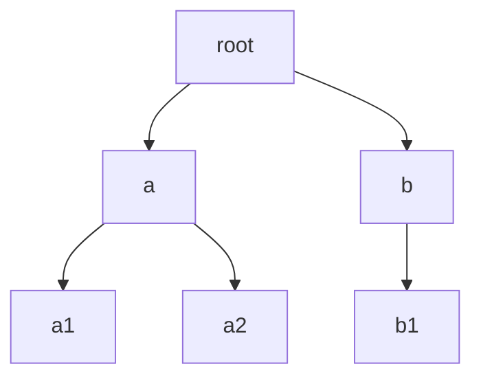

# Behavior trees

## Why this exists

A single state does one thing: it calls a model, or waits for the user, or runs a piece of Go. A behavior tree strings states together into a flow that handles one kind of request end to end: extract the name, look the client up, answer; or greet, wait for a question, reply. It is the unit the executive plans with: when the planner in Chapter 8 writes a step, the name in that step is the name of a tree, and the whole tree runs as that step.

The name comes from game AI, and it is worth one page to see what was borrowed and what was replaced, because the differences are exactly the things that will surprise you.

## A one-page primer on classical behavior trees

Behavior trees came out of game development as a replacement for finite state machines that had grown brittle. Instead of one rulebook full of transitions, small reusable behaviors are arranged in a tree, and traversing the tree composes them.

The leaves do the work: `Shoot`, `MoveTo`, `PlayAnimation`. A leaf returns one of three statuses: **Success**, **Failure**, or **Running**, meaning "still working, re-enter me next tick". The nodes above the leaves are *composites*, and they carry the control flow. A **Sequence** ticks its children left to right and stops on the first Failure: "do A, then B, then C". A **Selector** ticks its children left to right and stops on the first Success: "try A, else B, else C", a prioritized fallback. **Decorators** wrap a single child and modify its result: an Inverter flips Success and Failure, a Repeater runs its child N times. A **Parallel** runs several children at once under a policy such as "succeed when all succeed".

A tree is *ticked* every frame. Each tick starts at the root, follows the composite rules down to leaves, and returns a status. A leaf that returns Running is re-entered by the next tick; that is how "walk to the door over sixty frames" is expressed without a loop inside any node.

State lives in two places. The **blackboard** is a shared key-value store that nodes read and write, because a status cannot carry data: `MoveToEnemy` writes the enemy's position and `Shoot` reads it. And, in the *memory* variants of the composites, each keeps **per-node bookkeeping**, "which child am I on", so that a Sequence whose third child returned Running resumes there rather than restarting at the first.

Agent builders borrowed the idea for one property: the control flow is explicit data you can inspect, serialize, snapshot where execution stopped, and resume from there, which is the shape of a conversation that waits for the user.

## What Arboreal kept and what it replaced

| Classical behavior tree | Arboreal |
|---|---|
| A tree — one parent per node | A directed graph (`Graph[Behavior]`); a node may have several parents |
| Composites: Sequence, Selector, Parallel, Decorators | **None.** A state returns a signal; the walk has one fixed reaction per signal |
| Success / Failure / Running | `nil` / `Skip` / `Terminal` / `CollectUserInput` / `Error` |
| Ticked every frame; `Running` re-enters | Called once per turn; pause/resume through `CollectUserInputSignal` and a stack kept on the struct |
| Leaves do small actions | Leaves are LLM calls, MCP tool loops, or arbitrary Go, each with the whole conversation |
| Blackboard + per-node state | `AnnotatedMessages` + `State`/`Traversed` fields on the tree |

```admonish tip title="Coming from LangGraph"
If you skipped the primer: read the table's right-hand column as "a `StateGraph` without conditional edges, whose nodes return control-flow signals, and whose compiled instance carries its own execution cursor."
```

## The struct

```go
type BehaviorTree struct {
    BehaviorName        string
    BehaviorDescription string
    Example             string
    Graph               Graph[Behavior]   // static: nodes and edges
    State               Stack[Behavior]   // live: the traversal stack
    Traversed           map[string]bool   // live: visited set, keyed by Hash()
    ClientID            string
}
```

The fields fall into two groups. `Graph` is what you wire: the nodes and the directed edges between them, stored in `structs.go` as a `Nodes` slice and an adjacency matrix. `State` and `Traversed` are the execution cursor: the stack of behaviors still to visit and the set of hashes visited in the current run. They are ordinary fields on the struct, which is why a tree can stop mid-walk and continue on the next call, and why one instance must never be shared between goroutines. All seven fields carry JSON tags; the two unexported fields do not, and snapshots (Part III) match behaviors by `Hash()` against a freshly built tree, so restorable trees need pinned ids.

`CreateBehaviorTree(name, description, example)` returns an empty shell, no nodes, with a random hash. `CreateBehaviorTreeWithId` takes the hash as a fourth argument and pins it. `AddState(s)` adds a node. `AddTransition(from, to)` adds both endpoints if they are new and records a directed edge, so you rarely need `AddState`. The first node added, by either call, is the entry point: `Graph.Initial()` returns `Nodes[0]`, and nothing else marks a start.

`BehaviorName`, `BehaviorDescription` and `Example` are for the planner: the executive's prompt reads them straight off the struct to list what it can run and to build its sample response (Chapter 5, Chapter 8). `ClientID` is copied onto trace messages and nothing more.

## Run it

`examples/tree-loop` drives a tree without an executive. It builds a three-state tree and runs the loop a tree needs from its caller: call the tree, show what it said, and when it pauses, collect a message and call again. That loop is the piece of `RunLoop` a bare tree lacks, which Chapter 1 flagged.

```go
{{#include ../../../examples/tree-loop/main.go:tree}}
```

`greet` is a `*BehaviorState`, because `CannedResponseState` returns a pointer, while `ask` and `answer` are values wired by address, as Chapter 5 said. The first call runs on an empty history, which is safe only because `greet` appends a message before anything reads one.

```go
{{#include ../../../examples/tree-loop/main.go:loop}}
```

Run it with `go run ./examples/tree-loop`; it needs `OPENAI_TOKEN`. The parenthesized lines are printed by the loop, from the signal each call returned. The model's wording will vary; this is one session:

```text
[Assistant Response]

Hello! Ask me one question.

(tree paused: Wait for the user's question)

[User Message]

What is the tallest mountain in Europe?
$

[Assistant Response]

The tallest mountain in Europe is Mount Elbrus, which stands at 5,642 meters (18,510 feet) above sea level. It is located in the Caucasus mountain range in Russia.

(tree finished; the next call restarts it)

[User Message]

And the second tallest?
$

[Assistant Response]

Hello! Ask me one question.

(tree paused: Wait for the user's question)

[User Message]

$

(bye)
```

The first call ran `greet` and stopped at `ask`. The second, made after the question was appended, resumed at `answer` and ran out of states. Now look at the third call. The second question was appended, but what came back was the greeting, not an answer. The tree had run to its end, so its stack was empty, and an empty stack means the next call restarts from the entry: `greet` again, then `ask` again. The second question is answered only on the following turn, when the resumed tree reaches `answer` with that question already in the history. This is restart versus resume, explained below.

## How it works

### Wiring



This is the tree from `examples/signals`, wired in `build` with five `AddTransition` calls: `root → a`, `root → b`, `a → a1`, `a → a2`, `b → b1`. Each call runs `Graph.AddNode` on both endpoints, which looks the behavior up by `Hash()` and appends it to `Nodes` only if it is new, then records the edge in the adjacency matrix with a priority one higher than any edge already leaving `from`. `Graph.Children` returns a node's children sorted by that number, smallest first: a smaller number is a higher priority, and the lowest-priority child, the one added last, runs last.

Insertion order therefore matters twice. The first node added is the entry, so `root` is the entry because `root → a` was the first call. And among a node's children the first added runs first: `a` before `b`, `a1` before `a2`. Adding the same edge twice moves it to the lowest priority. A node may be the target of several edges, which a strict tree forbids, and nothing checks for cycles: `AddTransition(&a, &b)` followed by `AddTransition(&b, &a)` stores both edges. The next section says why that is harmless.

### The walk

```
if State is empty:            # fresh run
    push Initial(); Traversed = {}
while State is not empty:
    s = pop()
    if Traversed[s.Hash()]: continue
    Traversed[s.Hash()] = true
    history, sig = s.Call(ctx, history)
    if sig is *ErrorSignal:   wipe State; return history, sig
    children = Graph.Children(s)
    switch sig:
        *TerminalSignal:          wipe State; Traversed = nil; return history, nil
        *SkipSignal:              continue                     # children not pushed
        *CollectUserInputSignal:  push unvisited children (forward); return history, sig
    push unvisited children in reverse                        # nil: first-added on top
Traversed = nil
return history, sig
```

That is `BehaviorTree.Call` in `behavior.go` with the tracing removed. It is an iterative depth-first walk driven by two struct fields rather than by recursion: pop a behavior, skip it if its hash is in `Traversed`, otherwise mark it, call it, and react to the signal. Because the cursor is two plain fields and not a Go call stack, it can be left in place when the function returns, picked up by the next call, and, later, written to JSON.

`Traversed` guarantees that each node runs at most once per run, so a cycle in the graph is harmless: the back-edge leads to a hash already marked, and the child is not pushed. Execution is a DAG even when the wiring is not. It also means there is no way to loop inside one call. To loop, go up a level: the executive calls the tree again next turn.

Note the two places `Traversed` is set to `nil`: after the loop drains, and in the `Terminal` case. A completed walk leaves no visited set behind, and the fresh-run branch at the top makes a new map, so a restart begins clean. A pause leaves `Traversed` alone, which is how a resumed walk knows that `root` has already run.

### Restart vs resume

Re-entry branches on one condition, whether `State` is empty, and not on `Traversed`. A tree that drained its stack, by running to the end or by hitting `Terminal` or `Error`, restarts from the entry on the next call with a fresh visited set. A tree that paused with children still pushed resumes from them, honoring the visited set it kept.

So the position of a `PauseState` decides what the next turn does. A pause that is a leaf pushes nothing, so what the next turn does depends on what was already on the stack. In a chain that is nothing, and the tree restarts every turn: the quickstart is `chat → pause`, so every turn is `chat` again on a longer history, which is what a chat bot wants. A pause with a child resumes into that child, and a pause with pending siblings resumes into *them*. `examples/test` wires `chat → pause → chat2`, so the turn after the pause runs `chat2`; `examples/tree-loop` wires `greet → ask → answer`, so the turn after the pause runs `answer`, and the turn after that, with the stack drained, runs `greet`. Design rule: the next turn continues from whatever the pause leaves on the stack; make the pause the last node of a chain if the tree should start over, and wire what comes next as its child if it should carry on.

### Patterns

Without composites, the shapes you know become conventions about wiring plus the signal each state returns. Chapter 6 showed the lambdas; these are the wirings.

**Sequence.** A chain:

```go
tree.AddTransition(&extract, &lookup)
tree.AddTransition(&lookup, &answer)
```

Each returns `nil`; an `ErrorSignal` aborts the chain (Chapter 6).

**Selector.** Siblings under one parent, tried in insertion order:

```go
tree.AddTransition(&root, &tryA)
tree.AddTransition(&root, &tryB)
tree.AddTransition(&root, &tryC)
```

Each `try*` returns `&arboreal.SkipSignal{}` when it does not apply, which moves the walk to the next sibling already on the stack, and `&arboreal.TerminalSignal{}` when it has handled the case, which stops the tree. When no branch applies the last guard's Skip leaks; add a lowest-priority `nil` sibling as in the next pattern. The caveat (whole-tree only) and the in-tree alternative are in Chapter 6; the out-of-tree alternatives are a single Go state that switches on the annotation and calls the right helper, or one tree per alternative with descriptions the planner can tell apart (Chapter 8).

**Branch on an annotation.** An extracting state (Chapter 4) followed by sibling Go states that each `Skip` unless the annotation matches, each leading into its own subtree:

```go
done := &arboreal.BehaviorState{HashId: "done", Lambda: func(ctx context.Context, h arboreal.AnnotatedMessages) (arboreal.AnnotatedMessages, arboreal.Signal) {
    return h, nil
}}
tree.AddTransition(&classify, &ifRefund)   // Skips unless intent is "refund"
tree.AddTransition(&classify, &ifBilling)  // Skips unless intent is "billing"
tree.AddTransition(&classify, done)        // lowest priority: runs last, returns nil
tree.AddTransition(&ifRefund, &refundFlow)
tree.AddTransition(&ifBilling, &billingFlow)
```

`done` exists so the walk never ends on a guard: without it, when no branch matches the last state called is `ifBilling`, and its `SkipSignal` leaks out as the tree's return value, which the executive does not handle (Chapter 6). It always runs, on every path; its only job is to end the walk on `nil`. A real default must check the annotation itself and return `nil` either way. It needs its own `HashId` (sharp edge 6).

**Nesting.** A `*BehaviorTree` is a `Behavior`, so a tree can be a node of another tree:

```go
inner := arboreal.CreateBehaviorTree("lookup", "Finds the client record", "")
inner.AddTransition(&extractName, &fetchRecord)

outer.AddTransition(&classify, &inner)
outer.AddTransition(&inner, &reply)
```

The outer walk pops `inner`, marks its hash, and calls `inner.Call`, which runs the whole inner walk as one node. A `Terminal` inside `inner` is absorbed at `inner`'s own boundary, so `reply` still runs. A `CollectUserInput` inside `inner` propagates: the outer walk matches the same case, pushes `inner`'s successors, and returns the signal upward.

The limits are precise, and both come from the outer walk treating `inner` as one node. First, a pause *inside* the inner tree (say between `extractName` and `fetchRecord`) does not resume inside it that turn: `inner` is already marked, so the next call on `outer` runs `reply`, and `inner`'s kept stack waits until a later restart of `outer` reaches `inner`, which then resumes at `fetchRecord` and skips `extractName`. Second, a `SkipSignal` leaking out of `inner`, because its last state was a guard, is matched by the outer walk's `case *SkipSignal`, which prunes `inner`'s successors; and if the outer stack drains right there, the Skip leaks out of the outer tree too. Trailing guards can be fixed with a lowest-priority `nil` sibling inside `inner`; pauses have no fix below the top level.

## Coming from LangGraph

`add_edge(a, b)` maps directly onto `tree.AddTransition(&a, &b)`. `START` is not declared; it is whichever node you added first. `END` is not declared either; it is the walk running out of states, or a `TerminalSignal`. There is no `add_conditional_edges`; the Selector and annotation patterns above are what you write instead, with every destination wired and each deciding for itself whether to run. There is no subgraph node type, because a tree is a behavior and nesting is free, with the limits above.

The mapping breaks at the instance: a compiled `StateGraph` is stateless between invocations, with everything that persists in the checkpointer, while a `BehaviorTree` is not a program to be invoked but the execution itself, carrying its own cursor, so one instance is one conversation and a second needs a `Copy()`.

## Sharp edges

```admonish warning title="Sharp edge"
`Call` on a tree with no states panics: `Graph.Initial()` in `structs.go` indexes `Nodes[0]` unconditionally. `CreateBehaviorTree` returns an empty shell, so a tree you forgot to wire fails on first use, not at construction.
```

```admonish warning title="Sharp edge"
A tree is not safe for concurrent use: `State` and `Traversed` are plain fields. Never share one instance across goroutines; `Copy()` it (the copy has an empty cursor and the same hash). The executive copies per plan step for this reason.
```

```admonish warning title="Sharp edge"
A `PauseState` inside a nested tree does not resume that turn. When the inner tree returns `CollectUserInputSignal`, the outer walk has already marked it as traversed and pushes its successors; the next `Call` runs those, and the inner tree's kept stack (the states after its pause) waits. It is popped the next time the outer walk reaches the inner tree — usually a later restart — which then resumes after the pause instead of starting at its entry, so the inner tree's first half is skipped on that turn. `Copy()` does not protect you: the inner tree is shared by pointer. Pause only in top-level trees — the ones the executive runs as plan steps.
```

```admonish warning title="Sharp edge"
`Copy()` is one level deep. It copies the `Graph` struct, but `Graph.Nodes` holds the same `Behavior` pointers, so a nested `*BehaviorTree` node is shared by pointer — with its own `State` stack and `Traversed` set. Two concurrent plan steps of a behavior that contains a subtree therefore collide inside that subtree. Until `Copy` recurses, keep trees that the executive may run concurrently flat, or give each step its own freshly built tree.
```

```admonish warning title="Sharp edge"
After a pause, a node's children resume in reverse priority (forward push on the `CollectUserInput` path, reverse push on the `nil` path). See Chapter 6.
```

```admonish warning title="Sharp edge"
Two states with the same `Hash()` in one tree: `Graph.AddNode` merges them — the second's transitions attach to the first and its lambda never runs. See Chapter 5 on `HashId`.
```

## Back to the trace

Step 4 of Chapter 2 is `BehaviorTree.Call` on the step's copy of `chat_behavior`. The copy's stack is empty, so the fresh-run branch pushes `Graph.Initial()`, which is `chatState`, and makes a new `Traversed`. The loop pops `chatState`, marks it, calls it, gets `nil`, and pushes its one child, `pauseState`. It pops `pauseState`, calls it, and gets a `*CollectUserInputSignal`; the switch pushes the pause state's unvisited children, of which there are none, and returns the messages and the signal with `State` empty.

Step 7 is the re-entry rule. `executePlan` calls the same copy again, `State` is empty, and the walk restarts from `chatState` with a fresh visited set, which is why the quickstart runs `chatState` every turn. Had `pauseState` had a child, the second call would have resumed there.

The loop in `examples/tree-loop` is what `RunLoop` and `Execute` do around this call: call the tree, send back what it appended, and on `CollectUserInputSignal` wait for the user and call again.

```admonish example title="Recap"
- A tree is a directed graph of behaviors walked depth-first with an explicit stack; each node runs at most once per run.
- The first node added is the entry; insertion order is priority.
- Control flow is signals from the leaves; Sequence is a chain, Selector is siblings plus `Skip`/`Terminal` (whole-tree only).
- Empty stack → restart; pushed children → resume. Put the pause where the next turn should continue.
- Trees nest, with limits: no pause inside a nested tree, and `Copy` does not descend into it.
```
