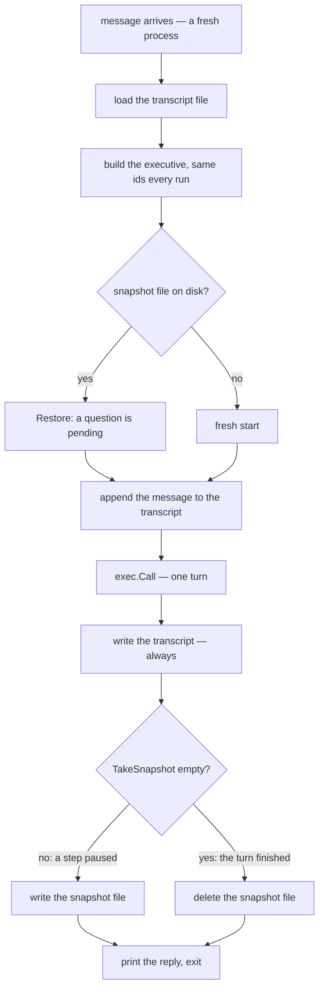

# Putting it together

Parts I and II built the vocabulary: annotated messages, states, signals, trees, and the executive that chooses between them. Part III took that vocabulary out of the chat loop — one `Call` per message, a snapshot across the process gap, a trace on the side, tools inside a state, and a hermetic zone to test in. This chapter spends all of it at once on a single program: the generic skeleton of an agent that lives behind a queue, a webhook, or a job runner — any caller that hands a process one message and expects it to exit.

## What we're building

`examples/bookshelf` is the assistant of a small bookstore, and it has no server, no loop, and no session. You invoke it once per message:

```text
$ go run ./examples/bookshelf "Do you have The Dispossessed in stock?"
```

Between two invocations nothing survives in memory — not the transcript, not the plan, not the position of the tree the last message was walking. Two files in the working directory carry all of it. `bookshelf-transcript.json` is the conversation, written and read by our code and by nothing in the framework (Chapter 9). `bookshelf-snapshot.json` is the executive's in-flight state, produced by `TakeSnapshot` and consumed by `Snapshot.Restore` (Chapter 10). The first is what you would show the customer; the second is what the framework needs to pick a half-finished task back up.



Everything above `exec.Call` in the diagram is reconstruction. The executive is rebuilt from scratch by the same constructor, with the same pinned ids it had last time, and the two files are read back into that rebuilt object: the transcript as a list of messages we hand to `Call`, the snapshot as a plan in flight. Everything below it is bookkeeping. `TakeSnapshot` answers one question — did this turn leave a step waiting on the customer? — and the answer decides whether the snapshot file is written or removed. The transcript is written either way, because it is the record of what was said and that record outlives every task in it.

Which leaves the invariant this chapter keeps returning to.

```admonish important
The snapshot file exists exactly when the agent has asked the user a question.
```

The framework guarantees only half of that: a snapshot is non-empty exactly while a step is paused (Chapter 10). This program earns the other half by a design decision in the next section — its one pausing tree always asks before it pauses.

## The behaviors

Three trees, so that the planner (Chapter 8) has a real choice to make on every message.

```go
{{#include ../../../examples/bookshelf/main.go:build}}
```

`recommend_book` is Chapter 4's pipeline end to end, inside one turn. `extract-genre` runs in annotation mode: its reply never joins the conversation, it is parsed and pinned onto the customer's message under `genre`. `recommend` then names `genre` in `ExtraContext`, so whatever the first state extracted arrives in the second state's system prompt under an `Extra Context:` heading. Nothing declared a schema and nothing merged a state dictionary; the annotation on the message is the entire handoff between the two states. `check_availability` is a single state with `AllowTools` set — Chapter 12's opt-in, whose tool is built further down this chapter. `place_hold` is the one tree with a pause in it, and it has a section of its own.

Every id in the function is pinned: `tree-recommend`, `state-extract-genre`, `state-recommend`, `tree-availability`, `state-lookup`, `exec-bookshelf`, and the hold tree's four. This is not tidiness. `Restore` resolves a snapshot's `ref`s by hash against a freshly built executive, and both of its failure modes are quiet or fatal rather than diagnosable: an executive id that no longer matches restores nothing and reports nothing, and a step whose `ref` names no behavior panics on a nil interface (Chapter 10). Ids in a program like this are schema, and the constructor is where the schema is declared.

The `Preamble` does three jobs. It pins the shape of a step's `direction` — restate the customer's message faithfully, in the third person, quoting it — which is Chapter 8's fix for a planner that paraphrases the request away before any behavior sees it. It authorizes an empty plan for a message that fits none of the behaviors, which is the only deliberate route to the `OutOfBoundsHandler`. And its last sentence is defensive rather than editorial: it forbids the reserved `Re-plan` step, because a tombstone carried into a kept plan makes the snapshot of that turn a panic — the sharp edge below has the mechanism. `OutOfBoundsHandler` is set for the same kind of reason the `Preamble` is: leave the `Preamble` unset and a U+FFFD lands at the top of the planner and summarizer prompts, leave the handler unset and an out-of-bounds message gets the framework's placeholder sentence (Chapter 8).

Then the design decision the rest of the program rests on: which trees pause. Only `place_hold` ends in a `PauseState`. That matters because a pause is the only thing that keeps a step alive into the next turn — Chapter 10's first condition, the `*CollectUserInputSignal` triage in `Execute` — so a tree that always ends in one is a tree whose step is never dropped. Every later message then resumes that step and the planner never chooses again. For a dedicated chat loop, such as `examples/snapshot-simple`, that is exactly right: there is only one behavior and the conversation *is* the behavior. For an agent with several jobs it is wrong, because the first request would capture every message after it. Here a pause means precisely one thing — this task needs the customer's answer before it can finish — and `recommend_book` and `check_availability` complete their step instead, leaving the plan empty and the planner free to choose afresh. Continuity between finished turns rides the transcript we hand to `Call`, not a step held open on the executive.

Two things this arrangement does not promise. The first is that a recommendation comes from the shelf: `recommend_book`'s states never see the catalog — no tool, no `ExtraContext` carrying it — so the model recommends from what it knows, and may well name a book the store does not stock. That is correct behavior, and worth understanding as a general rule: a behavior's `Name` and `Description` are its interface to the planner, not a guarantee of capability, and the planner will route to a well-named tree whether or not the tree can deliver. The second is an answer to two questions at once, when one of them pauses: a plan where one step pauses and another completes leaves exactly one kept entry, the single-step shortcut fires, and `Output` becomes the paused step's last message while the completed step's answer sits unread in the summaries (Chapter 8). "Do you have it, and put it on hold" in one message therefore loses the availability answer.

## The lifecycle

This is the heart of the program: three short functions, and a `main` that reads like the diagram.

```go
{{#include ../../../examples/bookshelf/main.go:restore}}
```

Then `main` itself. Its middle — the trace channel with its drain, and the MCP mux — belongs to the two sections after this one; read past it for now.

```go
{{#include ../../../examples/bookshelf/main.go:lifecycle}}
```

And the end of every run:

```go
{{#include ../../../examples/bookshelf/main.go:persist}}
```

Top to bottom. `loadTranscript` reads our own file, treating a missing one as a fresh conversation rather than an error — the first invocation of a new conversation is the ordinary case, not the exceptional one. `buildExecutive` runs unconditionally, before anyone knows whether there is anything to restore, because `Restore` needs a fully built object to resolve hashes against. `restoreSnapshot` reads the snapshot file if it is there, and its one line of output — `(a question is pending — resuming the paused task)` — goes to stderr, where the whole narration lives.

Then the transcript question, which is the one design point most likely to be got wrong. `Restore` does assign the snapshot's own `history` key onto `exec.History`, but this program never reads it: the list handed to `Call` is the one loaded from the transcript file, with the incoming message appended. That is Chapter 10's "Owning the transcript" in code. The snapshot is a cache of what is pending and vanishes the moment nothing is; the transcript is the system of record and must survive a finished conversation, an id change, and a restore that finds nothing.

`exec.History` is assigned *after* `Call`, for a reason that is easy to skip past: `Call` never touches `History` (Chapter 9's table), and `TakeSnapshot` reads it. Without the assignment the snapshot would carry a stale or empty `history` next to a perfectly live `plan`, and nothing would complain. Here the assignment makes the two views agree, at the cost of the transcript being stored twice while a question is pending — once in our file, once inside the snapshot. Only our copy is ever read back.

`persist` writes the transcript first and the snapshot second. The order is deliberate: everything after the write is code that can panic, and a panic must never be able to lose the customer's message. It buys less than it looks — a panic inside `Call` loses the message anyway — but the writes and the deletes after it are exactly where a half-finished `persist` would leave the two files disagreeing, and that is the state worth ruling out. Then `TakeSnapshot`, and the branch the diagram ends on. An empty map is not a failure — it is what a finished conversation looks like, since an executive with nothing pending is absent from its own snapshot — so the empty branch *deletes* the file rather than writing an empty one. Leaving a stale snapshot behind would be worse than losing it: the next invocation would restore a task that is already done, resume a step nobody is waiting on, and route the customer's next message into it.

## A real tool

The catalog is Chapter 12's technique with no variation at all: an ordinary Go function, an MCP server in the same process, and a mux in the context.

```go
{{#include ../../../examples/bookshelf/main.go:tool}}
```

```go
{{#include ../../../examples/bookshelf/main.go:mcp}}
```

`lookupBook` is a function over a slice; what makes it a tool is `mcp.AddTool`, and what describes it to the model is the typed parameter struct — the SDK infers the input schema from `bookQuery`, so the `json` tag on `Title` is the argument name the model will write. The guard on the empty query is not defensive padding: `strings.Contains(x, "")` is true for every `x`, so a call that arrives with no title would otherwise match and return the entire catalog as if it had been asked for. And note the reach of `AllowTools`: only `state-lookup` sets it, so the mux in the context is invisible to the planner, to the annotation-mode extractor, and to every other state in the program (Chapter 12). One tool, one state that may call it, and the rest of the program cannot tell that MCP is running at all.

## A pause that outlives the process

Here is the showpiece — a tree whose middle is a process boundary.

```go
{{#include ../../../examples/bookshelf/main.go:hold}}
```

Nothing in it calls a model. The question is a canned line, the pause is a `PauseState`, and the answer is read by a lambda that scans the customer's words for the first decisive one. The word scan is worth a sentence of its own: `strings.FieldsFunc` splits on everything that is not a letter, so the lambda matches *words* rather than substrings, and it has to — `"ok"` is a substring of `"book"`, and a bookstore's customers say "no, don't book it" — which `FieldsFunc` splits at the apostrophe, which is why the refusal list carries `"don"` and not `"don't"`. Being model-free buys two things at once. The live demo is deterministic, because the question the customer sees is the canned line verbatim; and the whole pause round trip is testable without a token, which the last section of this chapter cashes in.

Run it, then run it again. It needs `OPENAI_TOKEN`, and it leaves `bookshelf-transcript.json` and `bookshelf-snapshot.json` in the directory you run from — delete both to start a fresh conversation. These two invocations are the fourth and fifth messages of the session at the end of this chapter, so the transcript on disk already holds three exchanges when the first of them runs. Below is stdout, plus the one stderr line that announces the resume and the `ls` after each run; the trace lines are dropped here and read in the next section.

```text
$ go run ./examples/bookshelf "Great — put it on hold for me, please."

Bookshelf: I can put that title on hold at the counter for three days. Should I go ahead? (yes/no)

$ ls bookshelf-*.json
bookshelf-snapshot.json
bookshelf-transcript.json

$ go run ./examples/bookshelf "Yes, go ahead."
(a question is pending — resuming the paused task)

Bookshelf: The customer said: "Yes, go ahead.". Done — the book is on hold at the counter for three days.

$ ls bookshelf-*.json
bookshelf-transcript.json
```

There it is on disk. After the question, both files; after the answer, only the transcript — and the deletion was not a tidy-up, it was `TakeSnapshot` coming back empty. Run five left nothing pending, so there is nothing for run six to resume, and the planner will choose afresh from the three behaviors when the next message arrives.

The pause here sits *mid-chain*, between `ask-confirm` and `place-hold`. That is the half of Chapter 7's restart-vs-resume rule no earlier snapshot showed — the rule Chapter 10 carried across the process exit, now seen from the resume side. When `waitConfirm` returned its `*CollectUserInputSignal`, the tree pushed its children before returning, so `place-hold` was still on the `State` stack at snapshot time; a tree with a non-empty stack records its own entry, the step skeleton's nested `snapshot` carries it, and the restored copy resumes at `place-hold` instead of restarting at the question. Compare `examples/snapshot-simple`, where the pause is a leaf, the stack is empty, and the next turn re-runs the tree from its entry state.

The two replies reach stdout by different routes. The pausing turn's reply is the canned question verbatim, because a single kept step short-circuits the summarizer (Chapter 8). The finishing turn has no kept step, so it does go through the summarizer, and what you read is the summarizer's rendering of `holdPlaced` rather than the constant itself. In this capture it kept the sentence intact behind its `The customer said: …` framing; another run may reword it. That is why the test below asserts the constant at the tree level and the empty snapshot at the executive level, and never the finishing reply.

## Watching it run

The trace is attached exactly as Chapter 11 requires: an unbuffered channel, a goroutine draining it before the first `Call` — attach one and fail to drain it and the turn deadlocks silently — and the narration written to stderr so that stdout stays a clean conversation. The attachment itself is back in `main`: a `context.WithValue` under the bare string `"arboreal_trace"`, because the framework exports no key and no helper for it (Chapter 11) — which is why this program spells the literal out next to a typed `WithMCPClient` call three lines below.

```go
{{#include ../../../examples/bookshelf/main.go:drain}}
```

Here is the full stderr of the pausing run:

```text
begin_call Bookshelf        entering planner state
begin_call place_hold       entering behavior tree
begin_call ask-confirm      entering custom state
end_call   ask-confirm      leaving custom state
begin_call wait-confirm     entering custom state
end_call   wait-confirm     leaving custom state  [signal: user "Wait for the customer's confirmation"]
end_call   place_hold       leaving behavior tree  [signal: user "Wait for the customer's confirmation"]
end_call   Bookshelf        leaving planner state
```

Three nesting levels, read from the outside in: the executive's envelope around the whole turn, the tree the planner chose, and one begin/end pair per state the walk visited. Both states have names, including the pause — `waitConfirm.StateName = "wait-confirm"` — which is the difference between this trace and Chapter 11's, where the anonymous line was a `PauseState` nothing had named. The pause's signal rides the `end_call` of the state that raised it and again of the tree that returned it, and stops there: the executive's `end_call` carries none, because `Call` always returns `nil` however much paused inside it.

The out-of-bounds path prints a shorter trace, and the one state in it is still anonymous, both times:

```text
begin_call Bookshelf        entering planner state
begin_call                  entering custom state
end_call                    leaving custom state
end_call   Bookshelf        leaving planner state
```

No tree at all — the plan was empty, so `Execute` called the `OutOfBoundsHandler` directly — and the handler is a bare `CannedResponseState` with a `HashId` but no `StateName`. Name a state or its lines are anonymous.

## A session, end to end

Five invocations, five processes, one conversation. Only stdout is shown, and only runs one, four and five are reproducible word for word — the rest is the model's wording and will vary.

```text
$ go run ./examples/bookshelf "Hi there!"

Bookshelf: I can recommend a book, check whether we have one in stock, or put one on hold.

$ go run ./examples/bookshelf "I love science fiction — can you recommend something?"

Bookshelf: The customer said: "I love science fiction — can you recommend something?". The assistant recommends "Dune" by Frank Herbert, as it's a classic that intricately weaves politics, ecology, and spirituality into a mesmerizing sci-fi narrative.

$ go run ./examples/bookshelf "Do you have The Dispossessed in stock?"

Bookshelf: The customer said: "Do you have The Dispossessed in stock?". Yes, we have "The Dispossessed" by Ursula K. Le Guin in stock. There are 2 copies available for $12.00 each.

$ go run ./examples/bookshelf "Great — put it on hold for me, please."

Bookshelf: I can put that title on hold at the counter for three days. Should I go ahead? (yes/no)

$ go run ./examples/bookshelf "Yes, go ahead."

Bookshelf: The customer said: "Yes, go ahead.". Done — the book is on hold at the counter for three days.
```

Each run took a different path through the machinery. The greeting fits none of the three behaviors, so the `Preamble`'s escape clause produced an empty plan and the reply is the `OutOfBoundsHandler`'s canned sentence, with no tree and no summarizer between it and stdout. The second run is the annotation pipeline: `extract-genre` pinned the genre onto the customer's message, `recommend` read it back through `ExtraContext`, and the summarizer turned the result into the reply — *Dune*, a title the store's catalog never lists, because nothing in `recommend_book` ever sees the catalog. The third is the tool round — the count and the price match the catalog row exactly, which is the point of a state told to answer from the tool's result and never to guess. The fourth and fifth are the pause, across two processes.

Runs 2, 3 and 5 open by restating the direction — `The customer said: …` — which is not a quirk of the model but the `Preamble` showing through. `interpolatedPreamble` is the first line of the summarizer prompts as well as the planner prompt (Chapter 8), so an instruction written to keep the planner's directions faithful also reaches the state that writes the final reply, and it obeys. That is worth seeing once: the `Preamble` is not a planner setting, it is the executive's voice, and it costs a phrase at the head of every summarized reply.

Every one of those five runs began with nothing in memory. The two files did all the remembering.

## Testing it

The hold tree was built model-free so that a test could reach it, and both halves of the round trip run without a token.

`TestHoldPausesAcrossProcesses` is `main`'s lifecycle with the process exit played by `encoding/json`, and it is Chapter 13's seeding technique earning its keep: a crafted `Restore` puts a step into the executive's unexported `plan` — still the only way to do that without invoking the planner — and then the two turns `main` would run follow.

```go
{{#include ../../../examples/bookshelf/main_test.go:exec-roundtrip}}
```

It asserts the verbatim question on the pausing turn and an empty snapshot after the finishing one, and never the finishing reply, which belongs to the summarizer. Its first line, `t.Setenv("OPENAI_TOKEN", "")`, is a deliberate guard rather than housekeeping: the finishing turn does reach the summarizer, the call fails without a token, `Execute` discards the signal, and the assertions still hold — but a machine with a token in its environment would quietly spend one on every run of the suite.

```go
{{#include ../../../examples/bookshelf/main_test.go:tree-roundtrip}}
```

`TestHoldTreeCursorSurvivesSnapshot` runs the same round trip one level down, on the tree alone, and pins what the executive-level test cannot see: the mid-chain cursor, the `State` stack and `Traversed` set surviving the marshal. The assertion on `holdPlaced` is what proves the restored copy *resumed*; a tree that had restarted from its entry state would have answered with the canned question instead, and the test would say so.

A third test, `TestHoldRefusalLeavesTheBookOnTheShelf`, is the only guard on the other branch of the lambda; it feeds `"No, don't book it."` and expects the book left on the shelf — exactly the assertion that catches a matcher rewritten to use `strings.Contains`.

## Coming from LangGraph

This program is the Arboreal answer to a checkpointer plus a `thread_id`, written out by hand. There is no store to configure and no thread registry: which conversation a message belongs to is which pair of files you load, and persistence happens where your code calls `TakeSnapshot` and `Restore` — at the turn boundary, once — instead of implicitly after every super-step. The cost is the bookkeeping in `main`; the benefit is that nothing is saved or loaded that you did not name, and that a finished conversation leaves behind exactly one artifact, the transcript, in a format you chose.

The graph is also not compiled and cached. `buildExecutive` runs on every message, building three trees and an executive from scratch, and the object it returns has no more identity than the ids it pins. That is the inversion worth internalizing: in LangGraph the compiled graph is a durable thing and the state flows through it; here the executive is disposable and the *ids* are durable, which is why changing one is a migration rather than a rename.

Last, the split between choosing and doing. The planner picks a tree by name, from names and descriptions written for it; a state with `AllowTools` calls a tool mid-completion and loops until the model stops asking. Those are two different mechanisms at two different layers (Chapter 12), and neither is a ReAct loop at the top of the agent. Nothing in this program lets the model choose its next behavior by calling a function, and nothing lets a tool call re-enter the planner.

## Sharp edges

```admonish warning title="Sharp edge"
A kept `Re-plan` tombstone makes `TakeSnapshot` panic. `Execute` carries a tombstone into the kept plan when some other step paused (Chapter 8), and a tombstone's `Behavior` is `nil`; `TakeSnapshot`'s executive case builds each step skeleton with `Ref: p.Behavior.Hash()`, which on a nil interface is `runtime error: invalid memory address or nil pointer dereference`. The turn itself succeeds, and the process dies while persisting it. Any executive that both pauses and permits re-planning can hit this; forbid `Re-plan` in the `Preamble`, as this example does, or drop tombstones from the plan before snapshotting.
```

## Back to the trace

Chapter 2 numbered seven steps and ran all of them inside one process, in one pass of `RunLoop`. Here they are again, spread across five.

Step 1's `Receive` is `os.Args[1]`, and the append it made to `History` is `loadTranscript` followed by one `AppendToMessages`. Step 2 is `Plan`, which ran on runs one through four and was skipped on run five, because `Restore` had already put a step back into `plan` before `Call` was reached. Steps 3 and 4 — the fan-out and the tree walk — are the inner lines of the trace, one begin/end pair per state. Step 5's triage is the thing `persist` reads back out: a kept step means a snapshot to write, an empty plan means a file to delete. Step 6's `Send` is a `Printf` to stdout. And step 7, the next turn, is a new process holding nothing at all, which rebuilds the world it needs from a constructor and two files.

Nothing on Chapter 2's page changed. It only stopped fitting in one process.

```admonish example title="Recap"
- One message, one process: load transcript → build (stable ids) → restore → append → `Call` → persist.
- The transcript is yours and always written; the snapshot exists exactly while a question is pending — delete it when `TakeSnapshot` comes back empty.
- Only a task that needs the user's answer ends in a pause; trees that finish let the planner choose afresh next message.
- One MCP tool, one `AllowTools` state; the rest of the program never knows.
- The model-free hold tree is the testable spine: the pause round trip runs hermetically.
```
