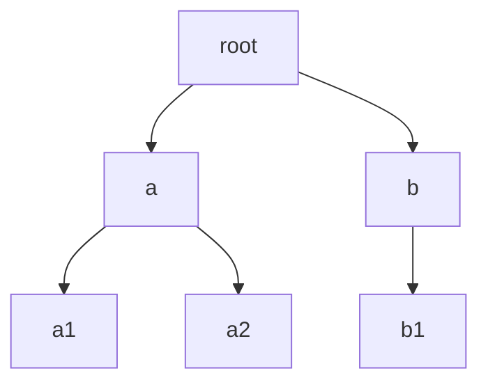

# The Arboreal Book (Parts I–II) Implementation Plan

> **For agentic workers:** REQUIRED SUB-SKILL: Use superpowers:subagent-driven-development (recommended) or superpowers:executing-plans to implement this plan task-by-task. Steps use checkbox (`- [ ]`) syntax for tracking.

**Goal:** Build the front matter and Parts I–II of *The Arboreal Book* as an mdbook under `book/`, backed by four new runnable examples under `examples/`, exactly as specified in `docs/superpowers/specs/2026-08-31-arboreal-book-parts-1-2-design.md`.

**Architecture:** Chapters live in `book/src/`; every code listing is `{{#include}}`d from a compiled package in `examples/` (with `// ANCHOR:` markers), so `go build ./...` keeps the book truthful. Examples are written and verified first (Tasks 2–5), then chapters are written in reading order (Tasks 7–15), each verified with `book/check.sh` (build + vet + warning-free `mdbook build`).

**Tech Stack:** Go 1.23, `mdbook` 0.5.4, `mdbook-mermaid` 0.17.1 (both installed at `~/.cargo/bin`), OpenAI via `OPENAI_TOKEN` for the non-hermetic examples.

**Conventions that apply to every task:**
- Commit messages: plain imperative subject, no `Co-Authored-By` trailer (repo rule in `CLAUDE.md`).
- References in prose are by identifier and file (`BehaviorTree.Call` in `behavior.go`), never by line number.
- Callouts are blockquotes with a bold lead: `> **Sharp edge.** …` and `> **Coming from LangGraph.** …`.
- Chapter shape (spec): Why this exists → Run it → How it works → Coming from LangGraph → Sharp edges → Back to the trace (Part II only) → Recap.
- Where a step says "expand into prose," write real paragraphs for a senior engineer; keep everything marked **verbatim** (include directives, mermaid blocks, callout texts, tables) exactly as given.

---

## File structure

```
book/
  book.toml                      # mdbook config (+ mermaid preprocessor, added by mdbook-mermaid install)
  mermaid.min.js, mermaid-init.js  # written by `mdbook-mermaid install`
  check.sh                       # build + vet + warning-free mdbook build
  src/
    SUMMARY.md
    introduction.md
    part-1/01-quick-start.md
    part-1/02-anatomy-of-one-turn.md
    part-1/03-from-langgraph.md
    part-2/04-messages-and-annotations.md
    part-2/05-behaviors-and-states.md
    part-2/06-signals.md
    part-2/07-behavior-trees.md
    part-2/08-the-executive.md
examples/
  signals/main.go, main_test.go  # hermetic: signal effects on traversal (Ch 6, 7)
  state-direct/main.go           # one LLMCompletionState called directly (Ch 5)
  tree-loop/main.go              # a tree driven by a hand-written loop (Ch 7)
  poetry/main.go                 # two-behavior executive + OOB handler (Ch 8)
.gitignore                       # + book/book/
README.md                        # + four lines in the Examples list
```

Include paths: a chapter at `book/src/part-2/06-signals.md` reaches the repo root with `../../../`, so an include is `{{#include ../../../examples/signals/main.go:build}}`.

---

### Task 1: mdbook scaffold and check script

**Files:**
- Create: `book/book.toml`
- Create: `book/src/SUMMARY.md`
- Create: `book/src/introduction.md` (placeholder heading only; filled in Task 7)
- Create: `book/src/part-1/01-quick-start.md`, `book/src/part-1/02-anatomy-of-one-turn.md`, `book/src/part-1/03-from-langgraph.md`, `book/src/part-2/04-messages-and-annotations.md`, `book/src/part-2/05-behaviors-and-states.md`, `book/src/part-2/06-signals.md`, `book/src/part-2/07-behavior-trees.md`, `book/src/part-2/08-the-executive.md` (each a single `# Title` line; filled in later tasks)
- Create: `book/check.sh`
- Modify: `.gitignore`

- [ ] **Step 1: Write `book/book.toml`**

```toml
[book]
title = "The Arboreal Book"
description = "Building agentic workflows with Arboreal's behavior trees and executive"
language = "en"
src = "src"

[output.html]
default-theme = "light"
git-repository-url = "https://github.com/zenful-ai/arboreal"
```

- [ ] **Step 2: Write `book/src/SUMMARY.md`**

```markdown
# Summary

[Introduction](introduction.md)

# Part I — The view from the top

- [Quick start](part-1/01-quick-start.md)
- [Anatomy of one turn](part-1/02-anatomy-of-one-turn.md)
- [If you come from LangGraph](part-1/03-from-langgraph.md)

# Part II — Building blocks, from the ground up

- [Messages and annotations](part-2/04-messages-and-annotations.md)
- [Behaviors and states](part-2/05-behaviors-and-states.md)
- [Signals](part-2/06-signals.md)
- [Behavior trees](part-2/07-behavior-trees.md)
- [The executive](part-2/08-the-executive.md)
```

- [ ] **Step 3: Create the nine stub chapter files**

Run:
```bash
mkdir -p book/src/part-1 book/src/part-2
printf '# Introduction\n' > book/src/introduction.md
printf '# Quick start\n' > book/src/part-1/01-quick-start.md
printf '# Anatomy of one turn\n' > book/src/part-1/02-anatomy-of-one-turn.md
printf '# If you come from LangGraph\n' > book/src/part-1/03-from-langgraph.md
printf '# Messages and annotations\n' > book/src/part-2/04-messages-and-annotations.md
printf '# Behaviors and states\n' > book/src/part-2/05-behaviors-and-states.md
printf '# Signals\n' > book/src/part-2/06-signals.md
printf '# Behavior trees\n' > book/src/part-2/07-behavior-trees.md
printf '# The executive\n' > book/src/part-2/08-the-executive.md
```

- [ ] **Step 4: Install the mermaid preprocessor assets**

Run: `mdbook-mermaid install book`
Expected: it prints that it added `[preprocessor.mermaid]` and `additional-js = ["mermaid.min.js", "mermaid-init.js"]` to `book/book.toml` and wrote `book/mermaid.min.js` and `book/mermaid-init.js`. Open `book/book.toml` and confirm both entries are present.

- [ ] **Step 5: Write `book/check.sh`**

```sh
#!/usr/bin/env sh
# Verifies the book: every included example compiles, every {{#include}}
# points at a real file and a real ANCHOR marker, and mdbook builds without
# a single warning or error.
set -eu
cd "$(dirname "$0")/.."

go build ./...
# engine/ has pre-existing vet failures unrelated to the book; vet only what the book includes.
go vet . ./examples/...

# mdbook silently emits an empty code block for an include whose anchor does
# not exist, so check every include target at the source before building.
grep -rHoE '\{\{#include [^}]+\}\}' book/src | while IFS= read -r line; do
  chapter=${line%%:*}
  spec=${line#*:}
  spec=${spec#\{\{#include }
  spec=${spec%\}\}}
  path=${spec%%:*}
  anchor=${spec#"$path"}
  anchor=${anchor#:}
  file="$(dirname "$chapter")/$path"
  if [ ! -f "$file" ]; then
    echo "book/check.sh: $chapter includes missing file $path" >&2
    exit 1
  fi
  if [ -n "$anchor" ] && ! grep -Eq "ANCHOR: ${anchor}([^A-Za-z0-9_-]|\$)" "$file"; then
    echo "book/check.sh: $chapter includes anchor '$anchor' not found in $path" >&2
    exit 1
  fi
done

log=$(mdbook build book 2>&1) || { printf '%s\n' "$log"; exit 1; }
# mdbook 0.5 logs right-aligned level words without brackets: " WARN ..." / "ERROR ...".
if printf '%s\n' "$log" | grep -Eq '(^|[[:space:]])(WARN|ERROR)[[:space:]]'; then
  printf '%s\n' "$log"
  echo "book/check.sh: mdbook build produced warnings or errors" >&2
  exit 1
fi

if grep -rq '{{#include' book/book/; then
  echo "book/check.sh: an include directive survived into the built HTML" >&2
  grep -rn '{{#include' book/book/ >&2
  exit 1
fi

echo "book OK"
```

Run: `chmod +x book/check.sh`

- [ ] **Step 6: Ignore the build output**

Append to `.gitignore`:
```
book/book/
```

- [ ] **Step 7: Run the check**

Run: `book/check.sh`
Expected: last line `book OK`. If mdbook reports the mermaid preprocessor missing, confirm `~/.cargo/bin` is on `PATH`.

- [ ] **Step 8: Commit**

```bash
git add book/book.toml book/src book/check.sh book/mermaid.min.js book/mermaid-init.js .gitignore
git commit -m "Scaffold the Arboreal book with mdbook and a build check"
```

---

### Task 2: `examples/signals` — hermetic signal demonstration

**Files:**
- Create: `examples/signals/main.go`
- Create: `examples/signals/main_test.go`
- Modify: `README.md` (Examples list)

Design: a fixed tree `root → {a → {a1, a2}, b → {b1}}` of print-only states. A `signals` map says which state returns which signal. Each scenario builds a fresh tree, calls it (once, or twice for the pause scenario), and records the visit order and the returned signal. No LLM, no token.

- [ ] **Step 1: Write the failing test**

```go
package main

import (
	"reflect"
	"testing"

	"github.com/zenful-ai/arboreal"
)

func TestVisitOrder(t *testing.T) {
	cases := []struct {
		name    string
		signals map[string]arboreal.Signal
		calls   int
		want    [][]string
	}{
		{
			name:  "nil everywhere: depth-first in insertion order",
			calls: 1,
			want:  [][]string{{"root", "a", "a1", "a2", "b", "b1"}},
		},
		{
			name:    "Skip prunes a's subtree but not its sibling",
			signals: map[string]arboreal.Signal{"a": &arboreal.SkipSignal{}},
			calls:   1,
			want:    [][]string{{"root", "a", "b", "b1"}},
		},
		{
			name:    "Terminal stops the whole tree",
			signals: map[string]arboreal.Signal{"a1": &arboreal.TerminalSignal{}},
			calls:   1,
			want:    [][]string{{"root", "a", "a1"}},
		},
		{
			name:    "Error aborts the tree",
			signals: map[string]arboreal.Signal{"a1": &arboreal.ErrorSignal{ErrorMessage: "boom"}},
			calls:   1,
			want:    [][]string{{"root", "a", "a1"}},
		},
		{
			name:    "CollectUserInput pauses; the next call resumes a's children in reverse",
			signals: map[string]arboreal.Signal{"a": &arboreal.CollectUserInputSignal{}},
			calls:   2,
			want:    [][]string{{"root", "a"}, {"a2", "a1", "b", "b1"}},
		},
	}

	for _, tc := range cases {
		t.Run(tc.name, func(t *testing.T) {
			results := exercise(tc.signals, tc.calls)
			var got [][]string
			for _, r := range results {
				got = append(got, r.visited)
			}
			if !reflect.DeepEqual(got, tc.want) {
				t.Fatalf("visit order = %v, want %v", got, tc.want)
			}
		})
	}
}

func TestReturnedSignals(t *testing.T) {
	if got := exercise(map[string]arboreal.Signal{"a1": &arboreal.TerminalSignal{}}, 1)[0].sig; got != nil {
		t.Fatalf("Terminal should be absorbed to nil, got %T", got)
	}
	if _, ok := exercise(map[string]arboreal.Signal{"a1": &arboreal.ErrorSignal{ErrorMessage: "boom"}}, 1)[0].sig.(*arboreal.ErrorSignal); !ok {
		t.Fatal("Error should propagate to the caller")
	}
	if _, ok := exercise(map[string]arboreal.Signal{"a": &arboreal.CollectUserInputSignal{}}, 1)[0].sig.(*arboreal.CollectUserInputSignal); !ok {
		t.Fatal("CollectUserInput should propagate to the caller")
	}
	if _, ok := exercise(map[string]arboreal.Signal{"b1": &arboreal.SkipSignal{}}, 1)[0].sig.(*arboreal.SkipSignal); !ok {
		t.Fatal("a trailing Skip is expected to leak out as the tree's return value")
	}
}
```

- [ ] **Step 2: Run the test to verify it fails**

Run: `go test ./examples/signals/`
Expected: FAIL — `undefined: exercise` (there is no `main.go` yet).

- [ ] **Step 3: Write `examples/signals/main.go`**

```go
// Package main is a learning-purposes example, NOT a template for real apps.
//
// It shows how the five signals steer BehaviorTree.Call, using print-only Go
// states — no LLM, no API token. Every scenario builds the same small tree:
//
//	root → a → a1
//	         → a2
//	     → b → b1
//
// and tells exactly one state to return a particular signal. The program
// prints the order in which states ran and the signal the tree handed back
// to its caller. Run it with:
//
//	$ go run ./examples/signals
//
// Things to notice in the output:
//
//   - With no signals at all the walk is depth-first in insertion order:
//     root a a1 a2 b b1.
//   - SkipSignal prunes the subtree below the state that returned it; the
//     state's siblings still run.
//   - TerminalSignal stops the whole tree, and the caller sees nil — the
//     tree absorbs it.
//   - ErrorSignal stops the tree and is returned to the caller.
//   - CollectUserInputSignal stops this call but keeps the tree's stack, so
//     the next call resumes with the paused state's children. Watch the
//     order: a2 runs before a1, because the pause path pushes children in
//     the opposite order from the normal path.
//   - A SkipSignal from the very last state visited leaks out as the tree's
//     return value.
package main

import (
	"context"
	"fmt"
	"strings"

	"github.com/zenful-ai/arboreal"
	"github.com/zenful-ai/arboreal/llm"
)

// ANCHOR: recorder
// recorder hands out states that do nothing except append their name to
// visited and return the signal they were given.
type recorder struct {
	visited []string
}

func (r *recorder) state(name string, sig arboreal.Signal) *arboreal.BehaviorState {
	return &arboreal.BehaviorState{
		// The tree keys its visited-set by Hash(), so every state needs a
		// distinct id. The name is a fine id here.
		HashId:    name,
		StateName: name,
		Lambda: func(ctx context.Context, history arboreal.AnnotatedMessages) (arboreal.AnnotatedMessages, arboreal.Signal) {
			r.visited = append(r.visited, name)
			return history, sig
		},
	}
}

// ANCHOR_END: recorder

// ANCHOR: build
// build wires the tree. signals maps a state name to the signal that state
// should return; states not in the map return nil ("done, carry on").
func build(r *recorder, signals map[string]arboreal.Signal) *arboreal.BehaviorTree {
	tree := arboreal.CreateBehaviorTree("signals", "Demonstrates how signals steer traversal", "")

	root := r.state("root", signals["root"])
	a := r.state("a", signals["a"])
	a1 := r.state("a1", signals["a1"])
	a2 := r.state("a2", signals["a2"])
	b := r.state("b", signals["b"])
	b1 := r.state("b1", signals["b1"])

	// The first state wired in becomes the entry point, and among a state's
	// children, insertion order is priority: a runs before b, a1 before a2.
	tree.AddTransition(root, a)
	tree.AddTransition(root, b)
	tree.AddTransition(a, a1)
	tree.AddTransition(a, a2)
	tree.AddTransition(b, b1)

	return &tree
}

// ANCHOR_END: build

// ANCHOR: exercise
type callResult struct {
	visited []string
	sig     arboreal.Signal
}

// exercise builds a fresh tree and calls it `calls` times on the same
// history, recording each call's visit order and returned signal.
func exercise(signals map[string]arboreal.Signal, calls int) []callResult {
	r := &recorder{}
	tree := build(r, signals)

	// A state must never see an empty history (BehaviorState.Call reads the
	// last message after the lambda runs), so seed it with one user message.
	history := arboreal.AppendToMessages(nil, llm.ChatCompletionMessage{
		Role:    llm.ChatMessageRoleUser,
		Content: "go",
	})

	var results []callResult
	for i := 0; i < calls; i++ {
		r.visited = nil
		var sig arboreal.Signal
		history, sig = tree.Call(context.Background(), history)
		results = append(results, callResult{
			visited: append([]string(nil), r.visited...),
			sig:     sig,
		})
	}
	return results
}

// ANCHOR_END: exercise

func describe(sig arboreal.Signal) string {
	switch s := sig.(type) {
	case nil:
		return "nil"
	case *arboreal.SkipSignal:
		return "SkipSignal"
	case *arboreal.TerminalSignal:
		return "TerminalSignal"
	case *arboreal.CollectUserInputSignal:
		return "CollectUserInputSignal(" + s.Reason + ")"
	case *arboreal.ErrorSignal:
		return "ErrorSignal(" + s.ErrorMessage + ")"
	default:
		return fmt.Sprintf("%T", sig)
	}
}

func run(title string, signals map[string]arboreal.Signal, calls int) {
	fmt.Printf("== %s\n", title)
	for i, r := range exercise(signals, calls) {
		fmt.Printf("call %d: visited %-18s returned %s\n", i+1, strings.Join(r.visited, " "), describe(r.sig))
	}
	fmt.Println()
}

// ANCHOR: scenarios
func main() {
	run("nil everywhere: depth-first, insertion order", nil, 1)

	run("a returns Skip: a's subtree is pruned, its sibling b still runs",
		map[string]arboreal.Signal{"a": &arboreal.SkipSignal{Reason: "not applicable"}}, 1)

	run("a1 returns Terminal: the whole tree stops, the caller sees nil",
		map[string]arboreal.Signal{"a1": &arboreal.TerminalSignal{Reason: "done"}}, 1)

	run("a1 returns Error: the tree aborts and the error propagates",
		map[string]arboreal.Signal{"a1": &arboreal.ErrorSignal{
			ErrorMessage: "boom",
			ErrorType:    arboreal.StateErrorTypeUnrecoverable,
		}}, 1)

	run("a returns CollectUserInput: pause now, resume on the next call",
		map[string]arboreal.Signal{"a": &arboreal.CollectUserInputSignal{Reason: "need input"}}, 2)

	run("b1 (the last state) returns Skip: the Skip leaks out of the tree",
		map[string]arboreal.Signal{"b1": &arboreal.SkipSignal{Reason: "nothing to do"}}, 1)
}

// ANCHOR_END: scenarios
```

- [ ] **Step 4: Run the tests to verify they pass**

Run: `go test ./examples/signals/ -v`
Expected: `PASS` for all `TestVisitOrder` subtests and `TestReturnedSignals`.

- [ ] **Step 5: Run the program and save its output for Chapter 6**

Run: `go run ./examples/signals`
Expected (the `visited` order and `returned` value on every line must match; column padding may differ):
```
== nil everywhere: depth-first, insertion order
call 1: visited root a a1 a2 b b1  returned nil

== a returns Skip: a's subtree is pruned, its sibling b still runs
call 1: visited root a b b1        returned nil

== a1 returns Terminal: the whole tree stops, the caller sees nil
call 1: visited root a a1          returned nil

== a1 returns Error: the tree aborts and the error propagates
call 1: visited root a a1          returned ErrorSignal(boom)

== a returns CollectUserInput: pause now, resume on the next call
call 1: visited root a             returned CollectUserInputSignal(need input)
call 2: visited a2 a1 b b1         returned nil

== b1 (the last state) returns Skip: the Skip leaks out of the tree
call 1: visited root a a1 a2 b b1  returned SkipSignal

```
If the output differs, the framework changed; fix the test expectations only after re-reading `BehaviorTree.Call` in `behavior.go`.

- [ ] **Step 6: Add the example to the README list**

In `README.md`, in the `## Examples` list, add after the Little Spy line:
```markdown
- **Signals** (`examples/signals/`) - How each signal steers a behavior tree's traversal; runs without any API token
```

- [ ] **Step 7: Commit**

```bash
git add examples/signals README.md
git commit -m "Add signals example: hermetic demonstration of tree traversal under each signal"
```

---

### Task 3: `examples/state-direct` — one `LLMCompletionState` called directly

**Files:**
- Create: `examples/state-direct/main.go`
- Modify: `README.md` (Examples list)

- [ ] **Step 1: Write `examples/state-direct/main.go`**

```go
// Package main is a learning-purposes example, NOT a template for real apps.
//
// It calls a single LLMCompletionState directly — no behavior tree, no
// executive — to show what one state does to the conversation:
//
//  1. The System option is a template. {{ $date_llm }} is a built-in
//     meta-annotation that renders as "Today's date is: ...", so the model
//     knows the date without us hard-coding it.
//  2. Because System is set and the history has no system message yet, the
//     state prepends one. You can see the rendered prompt in the dump.
//  3. The model's reply is appended as an assistant message.
//
// Requires OPENAI_TOKEN to be set in the environment (the default model is
// gpt-4o-mini via the OpenAI provider).
package main

import (
	"context"
	"fmt"
	"log"

	"github.com/zenful-ai/arboreal"
	"github.com/zenful-ai/arboreal/llm"
)

func main() {
	// ANCHOR: state
	state := arboreal.LLMCompletionState(arboreal.LLMCompletionOptions{
		Name:        "date_aware_assistant",
		Description: "Answers briefly and knows today's date",
		System: "You are a terse assistant. {{ $date_llm }} " +
			"Answer in one sentence.",
	})
	// ANCHOR_END: state

	// ANCHOR: history
	history := arboreal.AppendToMessages(nil, llm.ChatCompletionMessage{
		Role:    llm.ChatMessageRoleUser,
		Content: "What day of the week is it today?",
	})
	// ANCHOR_END: history

	// ANCHOR: call
	history, sig := state.Call(context.Background(), history)
	if err, ok := sig.(*arboreal.ErrorSignal); ok {
		log.Fatal(err)
	}
	// ANCHOR_END: call

	// ANCHOR: dump
	for i, m := range history {
		fmt.Printf("[%d] %-9s %s\n", i, m.Role, m.Content)
	}
	// ANCHOR_END: dump
}
```

- [ ] **Step 2: Build and vet**

Run: `go build ./examples/state-direct && go vet ./examples/state-direct`
Expected: no output (success). Remove the produced `state-direct` binary if one appeared in the working directory: `rm -f state-direct`.

- [ ] **Step 3: Run it and capture sample output for Chapter 5**

Run: `go run ./examples/state-direct`
Expected shape (model wording varies; the structure must match):
```
[0] system    You are a terse assistant. Today's date is: Mon Aug 31 12:00:00 +0200 2026. Answer in one sentence.
[1] user      What day of the week is it today?
[2] assistant Today is Monday.
```
Save the real output; it is pasted into Chapter 5 as a sample.

- [ ] **Step 4: Add the example to the README list**

In `README.md`, in the `## Examples` list, add after the Signals line:
```markdown
- **State Direct** (`examples/state-direct/`) - Call one `LLMCompletionState` by hand and inspect what it does to the history
```

- [ ] **Step 5: Commit**

```bash
git add examples/state-direct README.md
git commit -m "Add state-direct example: a single LLMCompletionState called by hand"
```

---

### Task 4: `examples/tree-loop` — a tree driven by a hand-written loop

**Files:**
- Create: `examples/tree-loop/main.go`
- Modify: `README.md` (Examples list)

Design: tree `greet (canned) → ask (pause) → answer (LLM)`. The loop calls the tree, prints any assistant reply, reads user input, appends it, repeats. Because `answer` is a leaf, the tree's stack drains after it, so the *next* call restarts from `greet` — the greeting reappears every other turn. That is the restart-vs-resume rule made visible.

- [ ] **Step 1: Write `examples/tree-loop/main.go`**

```go
// Package main is a learning-purposes example, NOT a template for real apps.
//
// It drives a BehaviorTree directly, with a hand-written loop, and no
// TodoListExecutive at all. The loop is the part of RunLoop that a tree
// needs from its caller: call the tree, show what it said, and when it
// pauses for input, collect a message and call it again.
//
// The tree is:
//
//	greet → ask → answer
//
// greet is a canned assistant message, ask is a PauseState, answer is an LLM
// state. One full pass therefore takes two calls: the first runs greet and
// stops at ask (CollectUserInputSignal); the second, made after the user
// typed a question, resumes at answer. After answer the tree's stack is
// empty, so the third call starts over at greet — you will see the greeting
// again every other turn. That is the rule: a paused tree resumes, a drained
// tree restarts.
//
// Type a message and submit it with a line containing only "$" (or Ctrl-]).
// Submitting an empty message ends the session.
//
// Requires OPENAI_TOKEN to be set in the environment (the default model is
// gpt-4o-mini via the OpenAI provider).
package main

import (
	"context"
	"fmt"
	"log"

	"github.com/zenful-ai/arboreal"
	"github.com/zenful-ai/arboreal/llm"
)

func main() {
	// ANCHOR: tree
	tree := arboreal.CreateBehaviorTree("qa", "Greets the user, waits for a question, answers it", "")

	greet := arboreal.CannedResponseState("Hello! Ask me one question.")
	ask := arboreal.PauseState("Wait for the user's question")
	answer := arboreal.LLMCompletionState(arboreal.LLMCompletionOptions{
		System: "Answer the user's latest question in at most two sentences.",
	})

	// CannedResponseState returns a *BehaviorState; the other two factories
	// return values, hence the &. All three satisfy Behavior via pointer.
	tree.AddTransition(greet, &ask)
	tree.AddTransition(&ask, &answer)
	// ANCHOR_END: tree

	// ANCHOR: loop
	var channel arboreal.TerminalChannel
	var history arboreal.AnnotatedMessages
	ctx := context.Background()

	for {
		var sig arboreal.Signal
		history, sig = tree.Call(ctx, history)

		// Whatever the tree appended last is what it wants the user to see.
		if last := history.LastMessage(); last != nil && last.Role == llm.ChatMessageRoleAssistant {
			if err := channel.Send(&arboreal.ChannelMessage{Content: last.Content}); err != nil {
				log.Fatal(err)
			}
		}

		switch s := sig.(type) {
		case *arboreal.ErrorSignal:
			log.Fatal(s)
		case *arboreal.CollectUserInputSignal:
			fmt.Printf("(tree paused: %s)\n\n", s.Reason)
		default:
			// nil: the tree ran to the end and its stack is empty, so the
			// next Call will restart from greet.
			fmt.Println("(tree finished; the next call restarts it)")
			fmt.Println()
		}

		msg, err := channel.Receive()
		if err != nil {
			log.Fatal(err)
		}
		if msg.Content == "" {
			// TerminalChannel never returns an error, not even at EOF; an
			// empty message is the only way to notice the user is gone.
			return
		}
		history = arboreal.AppendToMessages(history, llm.ChatCompletionMessage{
			Role:    llm.ChatMessageRoleUser,
			Content: msg.Content,
		})
	}
	// ANCHOR_END: loop
}
```

- [ ] **Step 2: Build and vet**

Run: `go build ./examples/tree-loop && go vet ./examples/tree-loop && rm -f tree-loop`
Expected: no output.

- [ ] **Step 3: Run it for two full passes and capture the transcript for Chapter 7**

Run: `go run ./examples/tree-loop`, then type `What is the tallest mountain in Europe?`, a line `$`, then `And the second tallest?`, a line `$`, then `$` alone to end. (Do not drive it with a plain `printf … |` pipe: `TerminalChannel.Receive` creates a fresh `bufio.Scanner` per call and the first one slurps the whole pipe, so only the first message arrives. If you must script it, pace the lines, e.g. a `python3` loop that writes one line, flushes, and sleeps ~6 s between lines.)
Expected shape:
```
[Assistant Response]

Hello! Ask me one question.

(tree paused: Wait for the user's question)

[User Message]

What is the tallest mountain in Europe?
$

[Assistant Response]

Mount Elbrus, ...

(tree finished; the next call restarts it)

[User Message]

And the second tallest?
$

[Assistant Response]

Hello! Ask me one question.

(tree paused: Wait for the user's question)

[User Message]

$
```
The point to confirm: after the second user message the greeting appears again (restart), and the question is *not* answered until the next turn. Save the real transcript for Chapter 7.

- [ ] **Step 4: Add the example to the README list**

In `README.md`, in the `## Examples` list, add after the State Direct line:
```markdown
- **Tree Loop** (`examples/tree-loop/`) - Drive a behavior tree with your own loop instead of an executive; shows pause/resume vs restart
```

- [ ] **Step 5: Commit**

```bash
git add examples/tree-loop README.md
git commit -m "Add tree-loop example: a behavior tree driven by a hand-written loop"
```

---

### Task 5: `examples/poetry` — a two-behavior executive with an out-of-bounds handler

**Files:**
- Create: `examples/poetry/main.go`
- Modify: `README.md` (Examples list)

- [ ] **Step 1: Write `examples/poetry/main.go`**

```go
// Package main is a learning-purposes example, NOT a template for real apps.
//
// It shows the TodoListExecutive doing what it exists for: choosing between
// several behaviors. The executive holds two behavior trees — one writes
// haikus, one writes sonnets — and an out-of-bounds handler for everything
// else. On every user message the executive's planner (an LLM call) picks
// which behaviors to run, from their names and descriptions.
//
// Try these, submitting each with a line containing only "$":
//
//   - "A haiku about autumn rain"         → one step, write_haiku
//   - "A haiku and a sonnet about the sea" → two steps, run concurrently,
//     then merged into one reply by the executive's summarizer
//   - "What's the weather like?"          → an empty plan, so the
//     out-of-bounds handler answers
//
// The planner only sees each behavior's name, description and example — not
// its states — so those three strings are the whole interface between your
// trees and the planning LLM. Write them the way you would write a tool
// description.
//
// Requires OPENAI_TOKEN to be set in the environment (the default model is
// gpt-4o-mini via the OpenAI provider). Stop the program with Ctrl-C.
package main

import (
	"context"
	"log"

	"github.com/zenful-ai/arboreal"
)

func main() {
	// ANCHOR: behaviors
	haiku := arboreal.CreateBehaviorTree(
		"write_haiku",
		"Write a haiku (three lines, 5-7-5 syllables) on the topic the user asked for",
		"Write a haiku about autumn rain",
	)
	haikuState := arboreal.LLMCompletionState(arboreal.LLMCompletionOptions{
		System: "Respond only with a haiku that fits the user's request.",
	})
	haiku.AddState(&haikuState)

	sonnet := arboreal.CreateBehaviorTree(
		"write_sonnet",
		"Write a sonnet (fourteen rhymed lines) on the topic the user asked for",
		"Write a sonnet about the sea",
	)
	sonnetState := arboreal.LLMCompletionState(arboreal.LLMCompletionOptions{
		System: "Respond only with a Shakespearean sonnet that fits the user's request.",
	})
	sonnet.AddState(&sonnetState)
	// ANCHOR_END: behaviors

	// ANCHOR: executive
	exec := arboreal.CreateTodoListExecutive(
		"Poet",
		"Writes haikus and sonnets on request",
		&haiku, &sonnet,
	)

	// The Preamble is prepended to the planner's prompt. Two instructions:
	// keep the user's topic intact in each step's direction, and return an
	// empty plan for anything that is not a poetry request — an empty plan
	// is what routes a message to the out-of-bounds handler.
	exec.Preamble = "You are a poetry service. When writing a step's \"direction\", " +
		"restate the user's request faithfully, keeping the topic they asked for. " +
		"If the user did not ask for a haiku or a sonnet, return an empty JSON array: []"

	exec.OutOfBoundsHandler = arboreal.CannedResponseState(
		"Sorry, I only write haikus and sonnets.",
	)
	// ANCHOR_END: executive

	// ANCHOR: run
	if err := exec.RunLoop(context.Background(), arboreal.TerminalChannel{}); err != nil {
		log.Fatal(err)
	}
	// ANCHOR_END: run
}
```

- [ ] **Step 2: Build and vet**

Run: `go build ./examples/poetry && go vet ./examples/poetry && rm -f poetry`
Expected: no output.

- [ ] **Step 3: Run the three scripted prompts and capture the transcript for Chapter 8**

Run: `go run ./examples/poetry` and submit, in order (each followed by a `$` line): `A haiku about autumn rain`, `A haiku and a sonnet about the sea`, `What's the weather like?`. Stop with Ctrl-C.
Expected: a haiku; then a reply containing both a haiku and a sonnet (merged by the summarizer); then exactly `Sorry, I only write haikus and sonnets.`
If the third prompt is *not* answered by the canned message, the planner picked a behavior anyway — strengthen the last Preamble sentence (e.g. add "Do not invent a poetry request.") and re-run. If the process panics with `No plan named ... found!`, the planner invented a step name; that is the sharp edge documented in Chapter 8 — record the panic text for the chapter and re-run.
Save the real transcript.

- [ ] **Step 4: Add the example to the README list**

In `README.md`, in the `## Examples` list, add after the Tree Loop line:
```markdown
- **Poetry** (`examples/poetry/`) - An executive choosing between two behaviors, with an out-of-bounds handler for everything else
```

- [ ] **Step 5: Commit**

```bash
git add examples/poetry README.md
git commit -m "Add poetry example: an executive choosing between two behaviors"
```

---

### Task 6: Full build gate after examples

**Files:** none new.

- [ ] **Step 1: Run the whole check**

Run: `book/check.sh`
Expected: `book OK`. (The chapters are still stubs; this proves the four new packages build and vet cleanly alongside the rest.)

- [ ] **Step 2: Run the hermetic test suite**

Run: `go test ./examples/signals/ ./examples/little-spy/ .`
Expected: `ok` for all three packages.

No commit (nothing changed).

---

### Task 7: Introduction

**Files:**
- Modify: `book/src/introduction.md`

- [ ] **Step 1: Write the chapter**

Replace the stub with the following skeleton, expanding each `[prose: …]` bullet into paragraphs and keeping the rest verbatim:

```markdown
# Introduction

[prose: one paragraph — Arboreal is a Go framework for agentic AI systems. Its unit of composition is the *behavior*: anything that takes a conversation and returns an updated conversation plus a signal. Behaviors are wired into behavior trees (directed graphs of LLM calls, pauses and plain Go), and a plan-and-execute *executive* decides which trees to run for each user message. State is a message list; pause/resume is a first-class signal; the whole thing can be snapshotted.]

## Who this book is for

[prose: engineers who have already built agents with LangGraph or a similar framework and are new to Arboreal. Assumes fluent Go. Does not explain goroutines, interfaces or context.Context. Every chapter has a "Coming from LangGraph" sidebar that maps the concept you already know onto the Arboreal one.]

## What you need

- Go 1.23 or newer.
- `go get github.com/zenful-ai/arboreal`
- An OpenAI API key in `OPENAI_TOKEN`. Every example in this book uses the framework's default model, `gpt-4o-mini`, through the OpenAI provider, so this is the only credential you need. (One example, `examples/signals`, needs no key at all.)

All code in this book is included straight from the `examples/` directory of the repository and compiles with `go build ./...`. Run any of them with `go run ./examples/<name>`.

## How this book is organized

[prose: explain the spiral. Part I is a top-down pass: you run a chat bot (Chapter 1), then follow a single user message through every layer of the framework (Chapter 2) — naming each piece but not yet explaining it — and get a translation table from LangGraph (Chapter 3). Part II is a bottom-up pass: messages and annotations (4), states (5), signals (6), trees (7), the executive (8). Each Part II chapter ends with "Back to the trace", pointing at the step of Chapter 2 it just explained; Chapter 8 ends by re-reading the whole trace with nothing left unexplained. Say why neither pure direction works: the run loop lives on the executive, so hello-world needs the top of the stack, but explaining the executive honestly needs signals and pause/resume from the bottom.]

## A note on sharp edges

[prose: this book documents the framework as it is at the current commit, not as it is intended to be. Where the current behavior will surprise or bite you, you will find a callout like the one below. Each states the identifier involved and a workaround.]

> **Sharp edge.** Callouts in this style mark verified pitfalls in the current implementation. Read them; they are the parts of the framework that cost the authors an afternoon.
```

- [ ] **Step 2: Check**

Run: `book/check.sh`
Expected: `book OK`.

- [ ] **Step 3: Commit**

```bash
git add book/src/introduction.md
git commit -m "Book: write the introduction"
```

---

### Task 8: Chapter 1 — Quick start

**Files:**
- Modify: `book/src/part-1/01-quick-start.md`
- Source material: `examples/quickstart/main.go`, `README.md` Quick Start section, `channel.go` (`TerminalChannel.Receive`).

- [ ] **Step 1: Run the quickstart once and capture a transcript**

Run: `go run ./examples/quickstart`, type `Hi, I'm Paul. What can you do?`, a `$` line, then `Ctrl-C`. Keep the output.

- [ ] **Step 2: Write the chapter**

Skeleton (expand `[prose]`, keep the rest verbatim):

````markdown
# Quick start

[prose: two sentences — in this chapter you run a working chat bot and learn the *names* of its parts. Nothing is explained yet; Chapter 2 traces what happens, Part II explains why.]

## Run it

```bash
export OPENAI_TOKEN=sk-...
go run ./examples/quickstart
```

[prose: the program prints `[User Message]` and waits. Input is multi-line: type your message, then submit it with a line containing only `$` (a line containing only Ctrl-], then Enter, also works). Paste the transcript from Step 1 as a fenced block, and under it one line: "Notice the reply never uses your name. Chapter 2 explains why."]

> **Sharp edge.** `TerminalChannel.Receive` in `channel.go` never returns an error — not even at end of input. If you press Ctrl-D, the loop receives an empty message, runs it through the executive (one model call), prints the reply, and prompts again. Ctrl-D does not end the session; quit with Ctrl-C.

> **Sharp edge.** `TerminalChannel.Receive` builds a new `bufio.Scanner` over stdin on every call, and the first scanner reads the whole pipe into its private buffer. So `printf 'hi\n$\nagain\n$\n' | go run ./examples/quickstart` delivers only the first message; the rest is lost with the discarded scanner. Worse, once the pipe is drained every later `Receive` returns an empty message instantly, so the loop spins, calling the model on each pass, until you kill it. Drive the terminal examples interactively.

## The whole program

```go
{{#include ../../../examples/quickstart/main.go}}
```

## Naming the parts

[prose: walk the file top to bottom, one short paragraph per identifier, naming and *not* explaining. In order:]

- `arboreal.CreateBehaviorTree(name, description, example)` — a **behavior tree**: an empty container for states, with a name, a description and an example request. The three strings are for the planner (Chapter 8), not for you.
- `arboreal.LLMCompletionState(arboreal.LLMCompletionOptions{})` — a **state** that calls a language model with the messages it is handed and appends the reply. Empty options mean the default model, `gpt-4o-mini`, and no system prompt.
- `arboreal.PauseState("Let user respond")` — a state that does nothing but announce "I need the user to say something before this tree can continue."
- `chatBehavior.AddTransition(&chatState, &pauseState)` — an edge: after `chatState`, run `pauseState`. The first state ever added to a tree is its entry point, so this one line also makes `chatState` the start.
- `arboreal.CreateTodoListExecutive(name, description, &chatBehavior)` — the **executive**: the thing that owns the conversation, decides which trees to run for a request, and runs them; messages that arrive while a tree is waiting on the user go to that tree. Here it has exactly one tree to choose from.
- `exec.RunLoop(ctx, arboreal.TerminalChannel{})` — the **run loop**: receive a message from a **channel** (here, the terminal), run the executive, send the reply back, repeat.

[prose: note the pointers — `&chatState`, `&pauseState`, `&chatBehavior`. States and trees implement the `Behavior` interface with pointer receivers, so a tree is always handed around by address.]

> **Sharp edge.** The executive is not optional, even with one tree. `RunLoop` is a method on `TodoListExecutive`; a bare `BehaviorTree` has no loop of its own. Chapter 7 shows the loop you would otherwise write by hand, and Chapter 8 explains what the executive adds on top of it.

## Coming from LangGraph

[prose: a rough first mapping, to be refined in Chapter 3 — the tree is roughly a `StateGraph`, the two states are roughly nodes, `AddTransition` is roughly `add_edge`, `PauseState` is roughly `interrupt()`, and the executive plus `RunLoop` is roughly the compiled graph's `invoke` in a loop — except that the executive also *plans*, which has no LangGraph equivalent; that difference is the subject of Chapter 2.]

## Recap

- A **behavior tree** is a container of **states** connected by transitions; the first state added is the entry point.
- `LLMCompletionState` calls the model; `PauseState` waits for the user.
- The **executive** owns the conversation and runs the trees; `RunLoop` connects it to a **channel** such as the terminal.
- Submit input with a lone `$`; quit with Ctrl-C.
````

- [ ] **Step 3: Check**

Run: `book/check.sh`
Expected: `book OK`.

- [ ] **Step 4: Commit**

```bash
git add book/src/part-1/01-quick-start.md
git commit -m "Book: Chapter 1, quick start"
```

---

### Task 9: Chapter 2 — Anatomy of one turn

**Files:**
- Modify: `book/src/part-1/02-anatomy-of-one-turn.md`
- Source material: `executive.go` (`RunLoop`, `Plan`, `Execute`, `executePlan`), `behavior.go` (`BehaviorTree.Call`), `state.go` (`LLMCompletionState`, `PauseState`), `documentation/executive.md` (§1 is a line-by-line reading of `RunLoop`), `examples/snapshot-simple/main.go` (the `Preamble` comment).

This chapter is the spine of the book. Its seven steps are referenced by name ("step 2 of the trace") from every Part II chapter, so keep the numbering exactly as given.

- [ ] **Step 1: Write the chapter**

Skeleton (expand `[prose]`, keep the rest verbatim):

````markdown
# Anatomy of one turn

[prose: you typed a message into the quickstart and got a reply. This chapter follows that one message down through every layer of Arboreal and back up. You will meet every important identifier in the framework, in the order it runs. Do not try to understand the internals yet — Part II does that, one layer per chapter, and each of those chapters ends by pointing back to a step on this page. Read this chapter twice: now, and again after Chapter 8.]

## The stack

```
RunLoop(ctx, channel)             executive.go   the turn loop
  └─ Plan(ctx, history)           executive.go   an LLM writes a todo list of behavior names
  └─ Execute(ctx, history)        executive.go   runs the steps, decides the reply
       └─ executePlan(ctx, plan)  executive.go   one goroutine per step
            └─ Behavior.Call(ctx, messages)
                 ├─ BehaviorTree.Call     behavior.go   stack-based walk over the states
                 └─ BehaviorState.Call    state.go      one state: LLM call, pause, or Go
                      └─ ModelProvider.CreateChatCompletion   llm/
```

## One message, seven steps

```mermaid
sequenceDiagram
    participant U as TerminalChannel
    participant RL as RunLoop
    participant P as Plan
    participant E as Execute
    participant T as BehaviorTree.Call
    participant S as LLMCompletionState
    participant M as Model
    U->>RL: Receive(): "Hi, I'm Paul..."
    RL->>RL: History += user message
    RL->>P: Plan(ctx, History)
    P->>M: planner prompt (behaviors + last message)
    M-->>P: [{"name":"chat_behavior","direction":"..."}]
    P->>P: plan = [ step{ Copy(tree), Messages: [direction] } ]
    RL->>E: Execute(ctx, History)
    E->>T: go step.Behavior.Call(ctx, step.Messages)
    T->>S: chatState.Call
    S->>M: chat completion
    M-->>S: reply
    S-->>T: messages + reply, nil
    T->>T: pauseState.Call → CollectUserInputSignal
    T-->>E: messages, CollectUserInputSignal
    E->>E: keep step in plan; Output = step's last message
    E-->>RL: returns (Output is set)
    RL->>RL: History += assistant message
    RL->>U: Send(Output)
```

### Step 1 — Receive

[prose: `RunLoop` blocks in `Channel.Receive`. When the message arrives it is wrapped as a user-role `AnnotatedMessage` and appended to the executive's `History` — the transcript the executive owns for the whole conversation.]

### Step 2 — Plan

[prose: `plan` is empty, so `Plan` runs. It renders a prompt: the executive's `Preamble`, then a list of the available behaviors as `Name: Description` (plus the reserved step `Re-plan`), then the last few messages. One LLM call answers with a JSON array of steps, each a behavior **name** and a free-text **direction**. For each step, `Plan` makes a `Copy()` of the named behavior and gives it its **own** small message list, whose first message is a user-role message containing the direction. In the quickstart there is one behavior, so the plan is one step.]

> **Sharp edge.** The behavior does not see what the user typed. It sees the planner's *direction* — a paraphrase written by the planning LLM. With no instructions the paraphrase can drift ("my name is Paul" can become a greeting addressed to Paul). The workaround, from `examples/snapshot-simple`, is a `Preamble` that tells the planner how to write directions: `When writing the "direction" for a step, restate the user's message faithfully in the third person, quoting it`. Chapter 8 covers the `Preamble`.

### Step 3 — Execute, fan out

[prose: `Execute` hands the plan to `executePlan`, which starts one goroutine per step and calls `step.Behavior.Call(ctx, step.Messages)`. Steps run concurrently, each on its own copy of its behavior and its own message list. Results come back through a channel and are triaged by the **signal** each step returned.]

### Step 4 — The tree walks its states

[prose: inside the step, `BehaviorTree.Call` walks the graph with an explicit stack: it starts at the entry state, calls it, and pushes its children. `chatState` calls the model with the step's messages and appends the reply. Then `pauseState` runs and returns `CollectUserInputSignal`. The tree stops walking, keeps its stack on the struct, and returns the signal upward.]

### Step 5 — Execute decides the reply

[prose: `Execute` sees a `CollectUserInputSignal`. It keeps that step in `plan` (it is waiting for the user) and, because the kept plan is exactly one paused step, uses that step's last message — the model's reply — as the turn's `Output` without another model call. Otherwise it makes one more `LLMCompletionState` call with one of two system prompts: if steps are still pending, a prompt that folds their last messages into a single question; if nothing is pending, a prompt built from the transcript and the collected summaries. Edge to state: a step that is the only one left paused speaks for itself even if another step finished in the same turn — that finished step's output is dropped. Chapter 8 covers all three paths.]

### Step 6 — Send

[prose: `RunLoop` appends `Output` to `History` as an assistant message and calls `Channel.Send`. The turn is over.]

### Step 7 — The next turn

[prose: the user replies. `RunLoop` appends the message to `History` as before — but now `plan` is **not** empty, so `Plan` is skipped. Instead the new user message is appended to each pending step's own messages and `Execute` runs again. The tree's stack is empty (the pause state had no children), so the tree restarts from `chatState` — on the step's ever-growing conversation. That is the whole chat loop: plan once, then resume the paused step forever.]

> **Sharp edge.** There are two conversations. The executive's `History` is the transcript you would show a user: their messages and the executive's outputs. Each step's `Messages` is what the model actually sees: the planner's direction, the replies, and every later user message appended on resume. They are related but not identical, and when something looks wrong in a reply, the step's messages are the ones to inspect.

## Vocabulary

| Term | Meaning |
|---|---|
| **turn** | one pass through `RunLoop`: receive, (plan,) execute, send |
| **plan** | the list of steps the planner produced; empty means "plan afresh next turn" |
| **step** | a `Copy()` of one behavior plus its own message list |
| **direction** | the planner's free-text instruction for a step; the first message the behavior sees |
| **signal** | what a `Call` returns alongside the messages: `nil`, `Skip`, `Terminal`, `CollectUserInput`, or `Error` |
| **history** | the executive's transcript; distinct from a step's messages |
| **output** | the string the executive sends back for the turn |
| **pause / resume** | a step returning `CollectUserInputSignal` is kept in the plan; the next turn feeds it the user's reply instead of re-planning |

## Coming from LangGraph

[prose: in LangGraph one `invoke` runs your graph once; state persists via a checkpointer keyed by `thread_id`; an `interrupt()` stops the graph and `Command(resume=…)` continues it. In Arboreal the executive is the persistent object: `History` and `plan` live on it between turns, `CollectUserInputSignal` is the interrupt, and "resume" is simply the next `Execute` with the new message appended. The piece with no LangGraph analogue is step 2: an LLM chooses *which graph to run* before any graph runs.]

## Recap

- A turn is: receive → (plan if none pending) → execute → send.
- The planner produces steps: a behavior copy plus a message list that starts with the planner's **direction**, not the user's words.
- Steps run concurrently; the tree inside a step walks its states with a stack and stops at a pause.
- A paused step stays in the plan; the next turn resumes it rather than re-planning.
- `History` and a step's `Messages` are different lists.
````

- [ ] **Step 2: Check**

Run: `book/check.sh`
Expected: `book OK`. Open `book/book/part-1/02-anatomy-of-one-turn.html` in a browser and confirm the sequence diagram renders (if it shows raw text, the mermaid preprocessor is not wired — re-run Task 1 Step 4).

- [ ] **Step 3: Commit**

```bash
git add book/src/part-1/02-anatomy-of-one-turn.md
git commit -m "Book: Chapter 2, anatomy of one turn"
```

---

### Task 10: Chapter 3 — If you come from LangGraph

**Files:**
- Modify: `book/src/part-1/03-from-langgraph.md`
- Source material: `documentation/arboreal-analysis.md` §2 and §12–13 (the LangChain comparison; adapt to LangGraph terms), `behavior.go`, `executive.go`.

- [ ] **Step 1: Write the chapter**

Skeleton (expand `[prose]`, keep the table and callouts verbatim):

```markdown
# If you come from LangGraph

[prose: one paragraph — the vocabulary overlaps enough to mislead. This chapter is a translation table plus the three places where the translation breaks. Each row is expanded in the chapter named in its last column.]

## Rosetta stone

| LangGraph | Arboreal | Notes | Chapter |
|---|---|---|---|
| `StateGraph` | `BehaviorTree` | A directed graph, not strictly a tree; a node may have several parents | 7 |
| node function `(state) -> dict` | `BehaviorState.Lambda`: `func(ctx, history) (history, Signal)` | Takes and returns the whole conversation | 5 |
| typed `State` (`TypedDict`, reducers) | `AnnotatedMessages` + named annotations | The message list *is* the state; annotations are typed slots attached to messages | 4 |
| `add_edge(a, b)` | `tree.AddTransition(&a, &b)` | Also adds the nodes; the first node added is the entry point (`START`) | 7 |
| `add_conditional_edges` | *none* — edges are static; a node returns `SkipSignal` to prune its own subtree or `TerminalSignal` to stop the tree | Control flow lives in the leaf | 6, 7 |
| `END` | the walk running out of states, or `TerminalSignal` | | 7 |
| `interrupt()` / `Command(resume=…)` | `PauseState` → `CollectUserInputSignal`; the next `Execute` resumes | The tree keeps its own stack between calls | 6, 7, 8 |
| checkpointer + `thread_id` | `TakeSnapshot` / `Snapshot.Restore` | Requires stable behavior ids; coherent only between turns | Part III |
| `@tool`, `ToolNode` | MCP tools via `MCPClientMux` and `AllowTools: true` | No Go-defined tools; you run an MCP server | Part III |
| `create_react_agent` | `TodoListExecutive` | Plan-and-execute with concurrent steps, **not** a ReAct loop | 8 |
| `Send` (map-reduce fan-out) | the executive's plan: one goroutine per step, results summarized | Fan-out is decided by the planning LLM, not by your code | 8 |
| `Command(goto=…)` | *none* | | — |
| `astream` / `stream_mode` | *none* — completions are fully buffered | | — |
| `graph.invoke(...)` in a loop | `exec.RunLoop(ctx, channel)` | The loop is part of the framework and talks to a `Channel` | 1, 8 |

## Three mental shifts

### 1. Control flow lives in the leaf

[prose: in LangGraph you decide where to go next in a router function attached to an edge; the nodes stay ignorant of the graph. In Arboreal there are no conditional edges and no composite nodes (no Sequence, Selector, Parallel). A state decides its own control-flow effect and returns it as a signal; `BehaviorTree.Call` has one fixed reaction per signal. Consequence: a state that skips or terminates is less reusable across contexts, and a "selector" is siblings plus `SkipSignal`/`TerminalSignal` rather than a node type. Chapter 6.]

### 2. The agent layer plans, then executes, concurrently

[prose: `create_react_agent` interleaves thinking and tool calls one step at a time. `TodoListExecutive` makes one planning call that produces the whole todo list, runs every step at once in its own goroutine, and summarizes. Re-planning exists (`Re-plan` steps, up to `MaxPlanDepth`), but the default shape is fan-out, not a loop. Also: the executive chooses among *behaviors* by name, from their descriptions, and that is not function calling — it is free-form JSON parsed by the framework. Chapter 8.]

### 3. The tree is a stateful struct

[prose: a compiled LangGraph is immutable; state lives in the checkpointer. A `BehaviorTree` carries its traversal stack and visited-set on the struct itself — that is what makes pause/resume work without a checkpointer — so one tree instance is one execution. Two goroutines must never share a tree; the executive calls `Copy()` per plan step for exactly this reason. Snapshots (Part III) serialize that on-struct state by behavior id, which is why ids must be stable. Chapter 7.]

> **Coming from LangGraph.** The phrase "behavior tree" will also mislead if you know it from game AI: there are no Sequence/Selector nodes and no per-frame tick. Chapter 7 opens with a one-page primer and then lists exactly what Arboreal kept and what it replaced.

## Recap

- Same words, different machine: graph, node, edge and interrupt all exist, but conditional routing and composites do not.
- Signals from inside a state replace routers on edges.
- The executive is plan-and-execute with concurrent steps.
- A tree instance carries its own execution state; copy before sharing.
```

- [ ] **Step 2: Check**

Run: `book/check.sh`
Expected: `book OK`.

- [ ] **Step 3: Commit**

```bash
git add book/src/part-1/03-from-langgraph.md
git commit -m "Book: Chapter 3, coming from LangGraph"
```

---

### Task 11: Chapter 4 — Messages and annotations

**Files:**
- Modify: `book/src/part-2/04-messages-and-annotations.md`
- Source material: `annotation.go` (all of it: `Annotation`, `AnnotatedMessage`, `GetAnnotation`, `FlattenedAnnotations`, `AppendToMessages`, `AnnotationTemplate`, the template-syntax comment block), `state.go` (`evalIntoAnnotation`, the `ExtraContext` handling in `LLMCompletionState`), `examples/annotations-probe/main.go`, `documentation/arboreal-analysis.md` §5.

- [ ] **Step 1: Run the probe and capture its output**

Run: `go run ./examples/annotations-probe`. Keep the before/after dump.

- [ ] **Step 2: Write the chapter**

Skeleton (expand `[prose]`, keep the rest verbatim):

````markdown
# Messages and annotations

## Why this exists

[prose: every framework needs a place for state that flows between steps — LangGraph's `State`, a classical behavior tree's blackboard. Arboreal's answer is that the conversation itself is the state. A behavior takes the message list and returns it, and anything a state wants to hand to a later state is attached to a message as a named *annotation*. There is no second data structure to keep in sync with the transcript.]

## The types

```go
type Annotation struct {
    Name        string
    Data        any
    Explanation string
}

type AnnotatedMessage struct {
    llm.ChatCompletionMessage
    Annotations map[string]Annotation
}

type AnnotatedMessages []AnnotatedMessage
```

[prose: `AnnotatedMessage` embeds the provider-neutral `llm.ChatCompletionMessage` (`Role`, `Content`, `ToolCalls`, …), so `m.Role` and `m.Content` work directly. `Annotations` is a map from name to a typed value. `AnnotatedMessages` is the list every `Call` receives and returns; `ChatCompletionMessages()` strips the annotations when the list is sent to a model.]

## Run it

[prose: `examples/annotations-probe` calls a two-state tree directly. Both states are `LLMCompletionState`s with the `Annotation` option set, which means: do not append a reply; instead parse the model's answer and pin it onto the user's message under that name. Show the states and the dump.]

```go
{{#include ../../../examples/annotations-probe/main.go}}
```

[prose: paste the captured output. Point at what changed: no new messages, but the single user message now carries `name` and `profession` annotations.]

## How it works

### Reading annotations: `GetAnnotation`

[prose: `AnnotatedMessages.GetAnnotation(name)` searches from the newest message to the oldest and returns the first match — so the most recent write wins, and a later state can override an earlier one by writing the same name on a later message. If nothing matches and the name starts with `$`, three built-in *meta-annotations* are synthesized: `$last_message` (the content of the last message), `$date` (RFC 3339), `$date_llm` ("Today's date is: …", phrased for a prompt). `FlattenedAnnotations()` collects every annotation into one map, oldest to newest, last write wins.]

### Writing annotations

[prose: two idioms. `AppendToMessages(history, msg)` appends a new message with an empty, non-nil `Annotations` map. To annotate an existing message, write into `history.LastMessage().Annotations[name]` — the `examples/crm` states do this after a lookup. Because `Annotations` can be nil on messages you did not create with `AppendToMessages`, check or `make` it first.]

### Templates: `AnnotationTemplate`

[prose: `LLMCompletionOptions.System` and the executive's `Preamble` are parsed by `AnnotationTemplate`, a small mustache-like language whose variables are annotation names. Give the three forms:]

| Form | Renders as |
|---|---|
| `{{ name }}` | the annotation's `Data` coerced to a string (strings verbatim; ints, floats, `time.Time` formatted; anything else via `%v`); empty if absent |
| `{{ Preference: pref? }}` | multi-word block: words ending in `?` are annotation names; if **any** of them is empty, the **whole** block renders as empty — so a label disappears with its value |
| `{{ Sure?? pref? }}` | renders `Sure? tea` when `pref` is `tea`; `??` is a literal `?`, and only inside a multi-word block (a lone `{{ Really?? }}` is a single-word lookup and renders empty) |

[prose: `{{ $last_message }}` and `{{ $date_llm }}` work anywhere a template does. Chapter 5's example uses `{{ $date_llm }}` in a system prompt.]

### `ExtraContext`

[prose: an `LLMCompletionState` with `ExtraContext: []string{"name", "context"}` appends an `Extra Context:` section to its system prompt containing the `Data` of each named annotation that exists — a cheap way to feed a retrieval result or an extracted entity into the prompt without templating. `examples/crm` uses it to hand a client name and recalled memory to the answering state.]

### Annotation mode on `LLMCompletionState`

[prose: setting `Annotation: "name"` switches the state into `evalIntoAnnotation`. It sends **only** the rendered system prompt and the **last user message** to the model — not the whole history — expects a JSON object shaped like `Annotation` (`{"data": …, "explanation": …}`), and stores the parsed result on that user message under the given name. It appends nothing. If the reply is not valid JSON, or `data` is `null`, the raw reply string is stored as `Data` instead. Chapter 5 covers the rest of `LLMCompletionState`.]

## Coming from LangGraph

[prose: LangGraph `State` is a schema with reducers; Arboreal has no schema. An annotation is a name and an `any`, attached to whichever message produced it, found by searching backwards. The upside is that provenance is free — you can see which message an extracted fact came from. The downside is that nothing checks names or types; a typo in `ExtraContext` silently injects nothing.]

## Sharp edges

> **Sharp edge.** `Annotation.Data` is `any`. It survives a JSON round trip (snapshots, Part III) lossily: numbers come back as `float64`, objects as `map[string]any`. Code that type-asserts `Data.(string)` after a restore must expect the JSON shapes. `examples/little-spy` normalizes with `fmt.Sprint(a.Data)`.

> **Sharp edge.** The framework uses the annotation map for its own bookkeeping. `__trace_annotations` is a breadcrumb written by `AddTraceInformation` and scrubbed by `BehaviorState.Call`; `plan`, `raw_history` and `$context` are written by the executive. Iterate over annotations by the names you own, never over the whole map.

> **Sharp edge.** `evalIntoAnnotation` stores the raw JSON text as `Data` when the model answers `{"data": null}` — so "not found" can arrive as the string `{"data": null}` rather than as an empty value. Treat any `Data` that starts with `{` as a miss, as `examples/little-spy` does.

## Back to the trace

[prose: Step 2 of Chapter 2 — `Plan` runs an `LLMCompletionState` in annotation mode with `Annotation: "plan"`; the JSON todo list is read back with `GetAnnotation("plan")`. Each step's first message is created with `Annotations` holding `raw_history` and `$context`. Steps 4 and 7 — the model in `chatState` sees `ChatCompletionMessages()` of the step's list, annotations stripped.]

## Recap

- The message list is the state; annotations are named, typed slots attached to messages.
- `GetAnnotation` searches newest-first; `$last_message`, `$date`, `$date_llm` are built in.
- Templates: `{{ name }}`, conditional `{{ Label: name? }}`, escape `??`.
- `ExtraContext` injects annotations into a system prompt; annotation mode extracts them from a reply.
````

- [ ] **Step 3: Check**

Run: `book/check.sh`
Expected: `book OK`.

- [ ] **Step 4: Commit**

```bash
git add book/src/part-2/04-messages-and-annotations.md
git commit -m "Book: Chapter 4, messages and annotations"
```

---

### Task 12: Chapter 5 — Behaviors and states

**Files:**
- Modify: `book/src/part-2/05-behaviors-and-states.md`
- Source material: `behavior.go` (`Behavior` interface), `state.go` (`BehaviorState`, `BehaviorState.Call`, `CannedResponseState`, `PauseState`, `LLMCompletionState`, `LLMCompletionOptions`, `GenerateStringIdentifier`), `llm/model.go` (URIs), `llm/provider.go` (`CreateModelProvider`), `documentation/arboreal-behavior-state.md` (the envelope/lambda reading — reuse its §1 freely), `examples/state-direct/main.go` and the sample output captured in Task 3, `examples/crm/main.go` (the `HashId` regeneration idiom).

- [ ] **Step 1: Write the chapter**

Skeleton (expand `[prose]`, keep the rest verbatim):

````markdown
# Behaviors and states

## Why this exists

[prose: one interface underlies everything in Arboreal. A state, a tree of states, and the executive that runs trees are all *behaviors*, and a behavior is anything that can take a conversation and return an updated conversation plus a signal. That single contract is why trees nest inside trees and inside executives with no special node types. This chapter covers the interface and its leaf implementation, `BehaviorState`.]

## The `Behavior` interface

```go
type Behavior interface {
    Hashable            // Hash() string
    Name() string
    Description() string
    Call(ctx context.Context, messages AnnotatedMessages) (AnnotatedMessages, Signal)
    Copy() Behavior
}
```

[prose: `Call` is the contract: history in, history plus signal out. `Hash` is the behavior's identity — trees key their visited-set by it, snapshots reference behaviors by it. `Name`/`Description` are what the executive's planner sees. `Copy` produces an independent instance with the same hash, used by the executive so concurrent steps never share one stateful tree. `*BehaviorState`, `*BehaviorTree` and `*TodoListExecutive` all implement it, with pointer receivers.]

## `BehaviorState`: one struct, a pluggable lambda

```go
type BehaviorState struct {
    StateName        string
    StateDescription string
    HashId           string
    ClientID         string
    Lambda           func(ctx context.Context, history AnnotatedMessages) (AnnotatedMessages, Signal)
}
```

[prose: there are not four kinds of state; there is one struct and four factory functions that fill in `Lambda`. `BehaviorState.Call` is identical for all of them: it is a tracing envelope that records timing, optionally diffs the history for the trace, and otherwise just returns `b.Lambda(ctx, history)`. Adapt the "Call is a tracing decorator around Lambda" reading from `documentation/arboreal-behavior-state.md`.]

### The four factories

| Factory | Returns | What the lambda does |
|---|---|---|
| `BehaviorState{HashId: …, Lambda: …}` (a literal) | `BehaviorState` | anything: SQL, vector recall, parsing, branching by returning a signal |
| `CannedResponseState(text)` | `*BehaviorState` | appends `text` as an assistant message |
| `PauseState(reason)` | `BehaviorState` | returns `&CollectUserInputSignal{Reason}` and touches nothing |
| `LLMCompletionState(opts)` | `BehaviorState` | renders a system prompt, calls a model, appends the reply (or extracts an annotation) |

[prose: note the return types — one pointer, three values — and that wiring a value into a tree means taking its address. Writing your own: a literal `BehaviorState` with a distinct `HashId` and a `Lambda`; show a five-line example that reads an annotation, runs Go code, and returns `history, nil` or a signal — modelled on `lookupClientQuery` in `examples/crm/main.go`.]

## Run it

[prose: `examples/state-direct` builds one `LLMCompletionState` with a templated system prompt and calls it by hand.]

```go
{{#include ../../../examples/state-direct/main.go:state}}
```

```go
{{#include ../../../examples/state-direct/main.go:history}}
```

```go
{{#include ../../../examples/state-direct/main.go:call}}
```

```go
{{#include ../../../examples/state-direct/main.go:dump}}
```

[prose: paste the captured sample output as a fenced block and note that it is one run — model wording varies. Point at the three things it shows: the rendered `{{ $date_llm }}`, the prepended system message, the appended assistant reply.]

## How `LLMCompletionState` works

```go
type LLMCompletionOptions struct {
    Name, Description string
    ClientID, Id      string
    System            string   // template, see Chapter 4
    Model             string   // "openai:gpt-4o-mini-2024-07-18"; empty = llm.GPT4oMini
    ExtraContext      []string // annotation names appended to the system prompt
    Annotation        string   // if set: extract into this annotation, append nothing
    Terminal          bool     // return TerminalSignal after the reply
    AllowTools        bool     // offer MCP tools from the context (Part III)
}
```

[prose: walk the lambda in order — (1) `System` is rendered with `AnnotationTemplate` against the current history; (2) if `Annotation` is set, hand off to `evalIntoAnnotation` (Chapter 4) and return; (3) `CreateModelProvider(Model, ProviderOpenAI)` picks a provider from the URI prefix, defaulting to OpenAI; (4) `ExtraContext` annotations are appended to the prompt; (5) if `System` is non-empty, it becomes message 0 — replacing an existing system message or being prepended; (6) the model is called with `history.ChatCompletionMessages()`; (7) the reply is appended; (8) the signal is `nil`, or `TerminalSignal` if `Terminal`. `AllowTools` inserts a tool-calling loop between (6) and (7) — Part III.]

### Model URIs

[prose: a model is named `provider:model`, e.g. `llm.GPT4oMini` = `"openai:gpt-4o-mini-2024-07-18"`, `llm.ClaudeHaiku` = `"anthropic:claude-3-5-haiku-20241022"`. Providers: `openai` (`OPENAI_TOKEN`), `anthropic` (`ANTHROPIC_TOKEN`), `ollama` (`OLLAMA_SERVICE_URL`). Any model name after the prefix is passed through to the provider unchecked.]

### Identity: `HashId`

[prose: `Hash()` returns `HashId`. Factories generate a random id with `GenerateStringIdentifier("id-", 16)`; `LLMCompletionState` lets you pin it with `Id`, and any state's `HashId` field is exported. Two states in one tree must never share an id: the tree's visited-set would treat the second as already run. Stable ids also matter for snapshots (Part III).]

## Coming from LangGraph

[prose: a LangGraph node is a function of the state; a `BehaviorState` is a function of the conversation that also returns a control-flow signal. There is no `ToolNode`; the closest is `LLMCompletionState{AllowTools: true}`. There is no structured-output helper; annotation mode plus a JSON-instructing system prompt is the idiom.]

## Sharp edges

> **Sharp edge.** A state whose lambda returns an **empty** history panics: `BehaviorState.Call` in `state.go` dereferences `m.LastMessage()` after the lambda to scrub the trace breadcrumb. A tree that starts with a `PauseState` and is called on an empty history dies here. Always seed the history with at least one message (`AppendToMessages(nil, …)`), or start the tree with a state that appends.

> **Sharp edge.** Copying a state struct copies its `HashId`. Put both copies in one tree and `Graph.AddNode` treats the second as the first: its transitions attach to the original and its lambda never runs. Put them in different trees and the walk is fine, but `Snapshot.Restore` keys every behavior in the executive by hash, so a restore can rehydrate one tree with the other's state. `examples/crm` regenerates `HashId` with `GenerateStringIdentifier` after `evalForClientRecord := evalForClientQuery` for that reason.

> **Sharp edge.** An empty `Model` means OpenAI and `gpt-4o-mini`, and `CreateModelProvider` defaults an unprefixed model name to OpenAI too. A project that runs on Anthropic still needs `OPENAI_TOKEN` for any state that leaves `Model` empty — including the executive's own planner and summarizer states (Chapter 8).

> **Sharp edge.** `BehaviorTree.Copy()` copies the `Graph` by value, but the graph's `Nodes` slice holds the same `*BehaviorState` pointers, so every copy of a tree shares its state structs. That is harmless for the framework's own factories — a `BehaviorState` carries no execution state — but a `Lambda` that captures a mutable variable (a counter, a slice, a map) is shared across the concurrent plan steps the executive runs on those copies. Keep captured state read-only, or guard it with a mutex.

## Back to the trace

[prose: Step 4 — `chatState` is an `LLMCompletionState` with empty options: no system prompt, default model, reply appended, `nil` signal. `pauseState` is a `PauseState`. Step 2 — the planner itself is an `LLMCompletionState` in annotation mode, and `Plan` calls its `Lambda` directly, bypassing the tracing envelope.]

## Recap

- Everything is a `Behavior`; `Call(ctx, history) → (history, signal)` is the only contract.
- `BehaviorState` is one struct with a pluggable `Lambda`; `Call` is a tracing envelope around it.
- `LLMCompletionState` renders a templated system prompt, calls a model chosen by URI, appends the reply — or extracts an annotation.
- `HashId` is identity: unique within a tree, stable across runs if you want snapshots.
````

- [ ] **Step 2: Check**

Run: `book/check.sh`
Expected: `book OK`.

- [ ] **Step 3: Commit**

```bash
git add book/src/part-2/05-behaviors-and-states.md
git commit -m "Book: Chapter 5, behaviors and states"
```

---

### Task 13: Chapter 6 — Signals

**Files:**
- Modify: `book/src/part-2/06-signals.md`
- Source material: `signal.go`, `behavior.go` (`BehaviorTree.Call` — the error check before the switch, the switch, the `done:` label), `trace.go` (`TraceForSignal`), `executive.go` (`Execute` triage), `documentation/arboreal-behavior-trees.md` §5 and §7 "Signal handling under the hood" (reuse its propagation table), `examples/signals` and the exact output from Task 2 Step 5.

- [ ] **Step 1: Write the chapter**

Skeleton (expand `[prose]`, keep the rest verbatim):

````markdown
# Signals

## Why this exists

[prose: a `Call` returns two things: the conversation and a *signal*. The conversation is data; the signal is control flow. Arboreal has no conditional edges and no composite nodes, so the signal is the only way a state influences what runs next. Five values cover everything: carry on, skip my subtree, stop the tree, wait for the user, fail.]

## The five signals

```go
type Signal interface{ Description() string }

type ErrorSignal            struct{ ErrorMessage, ErrorType string } // also a Go error
type SkipSignal             struct{ Reason string }
type TerminalSignal         struct{ Reason string }
type CollectUserInputSignal struct{ Reason string }
// and nil
```

[prose: `ErrorType` is one of `StateErrorTypeRetryable`, `StateErrorTypeUnrecoverable`, `StateErrorTypeUnknown`, `StateErrorTypeLuaSyntax`; the framework does not act on the type today (no retry exists — `Execute` has a `// TODO: Retry!`), so treat it as documentation for your own handlers.]

## Run it

[prose: `examples/signals` builds one tree of print-only states and tells one state at a time to return a signal. No token needed.]

```go
{{#include ../../../examples/signals/main.go:recorder}}
```

```go
{{#include ../../../examples/signals/main.go:build}}
```

[prose: one sentence — `exercise` seeds a one-message history, calls the tree the requested number of times threading the history through, and records each call's visit order and returned signal.]

```go
{{#include ../../../examples/signals/main.go:exercise}}
```

```go
{{#include ../../../examples/signals/main.go:scenarios}}
```

```
$ go run ./examples/signals
== nil everywhere: depth-first, insertion order
call 1: visited root a a1 a2 b b1  returned nil

== a returns Skip: a's subtree is pruned, its sibling b still runs
call 1: visited root a b b1        returned nil

== a1 returns Terminal: the whole tree stops, the caller sees nil
call 1: visited root a a1          returned nil

== a1 returns Error: the tree aborts and the error propagates
call 1: visited root a a1          returned ErrorSignal(boom)

== a returns CollectUserInput: pause now, resume on the next call
call 1: visited root a             returned CollectUserInputSignal(need input)
call 2: visited a2 a1 b b1         returned nil

== b1 (the last state) returns Skip: the Skip leaks out of the tree
call 1: visited root a a1 a2 b b1  returned SkipSignal
```

[prose: read each scenario against the tree diagram; the next section explains the mechanism behind each line.]

## How it works

[prose: `BehaviorTree.Call` pops a state, calls it, and reacts to the signal. Errors are checked first, with `sig.(*ErrorSignal)`, and return immediately. Then a type switch handles the other three; `nil` falls through to "push the children". Present the table:]

| Signal | Stack | Children pushed? | Reaches the tree's caller? | Caller receives |
|---|---|---|---|---|
| `nil` | continues | yes, in reverse (first-added runs first) | — | — |
| `SkipSignal` | continues | **no** | only if it was the last state visited | a leaked `*SkipSignal` |
| `TerminalSignal` | wiped, `Traversed` reset | no | **no** — absorbed | `nil` |
| `CollectUserInputSignal` | kept, with children pushed | yes, in **forward** order | **yes**, unchanged | `*CollectUserInputSignal` |
| `ErrorSignal` | wiped | no | **yes** | `*ErrorSignal` (also an `error`) |

[prose: explain the two opposite propagation policies and why: `Terminal` means "this tree is done", which to a parent is a clean completion, so it is rewritten to `nil` — otherwise one leaf could kill every enclosing tree. `CollectUserInput` must reach the executive so it can stop and wait, so it passes through untouched. Explain what the executive does with each: `nil` → the step's last message becomes a summary input; `CollectUserInput` → the step is kept in the plan for next turn; `Error` → an "Error occurred: …" line is added to the summary inputs and the step is dropped.]

### Expressing control flow with signals

[prose: three patterns, each two or three sentences with a tiny lambda body — Sequence: a chain `a → b → c`, each returning `nil`, any returning `ErrorSignal` aborts. Selector: siblings under one parent; each returns `SkipSignal` when not applicable and `TerminalSignal` when it succeeded; caveat that `Terminal` clears the whole tree, so this only works when the selector is the whole tree (Chapter 7 expands). Branch on an annotation: a Go state reads `history.GetAnnotation("intent")` and returns `SkipSignal` to prune its own branch when the value does not match.]

## Coming from LangGraph

[prose: a router in `add_conditional_edges` chooses among named destinations; a signal can only prune (skip my subtree), stop, pause or fail. To choose between destinations, wire all of them as children and have each child skip itself when it does not apply — the decision moves from the edge into the destination.]

## Sharp edges

> **Sharp edge.** Signals must be returned as **pointers**. Every type switch in the framework — `BehaviorTree.Call`, `Execute`, and `TraceForSignal` in `trace.go` — matches `*ErrorSignal`, `*SkipSignal`, `*TerminalSignal`, `*CollectUserInputSignal`. A value such as `SkipSignal{Reason: "…"}` matches nothing. It never even reaches the tree's switch: `BehaviorState.Call` passes every returned signal through `TraceForSignal`, which panics with `unknown Signal type` at the state boundary (and a value `TerminalSignal{}` does not compile as a `Signal` at all, because only its pointer type has `Description`). `examples/crm` returns value signals and is wrong; write `&arboreal.SkipSignal{…}`.

> **Sharp edge.** A `SkipSignal` from the last state visited leaks out as the tree's return value (last scenario above). Callers that switch on the tree's signal should treat `*SkipSignal` as `nil`. The executive does not: `Execute`'s triage switch has cases only for `*ErrorSignal`, `*CollectUserInputSignal` and `nil`, so a plan step whose behavior returns a leaked `*SkipSignal` (or a bare state returning `*TerminalSignal`) is neither summarized nor kept — its output silently vanishes from the reply.

> **Sharp edge.** On the pause path children are pushed in forward order, so they resume in **reverse** priority (`a2` before `a1` above). With one child — the common case — this is invisible; with several, do not rely on insertion order after a pause.

## Back to the trace

[prose: Step 4 — `pauseState` returns `CollectUserInputSignal`; the tree pushes its (zero) children, stops, and returns the signal. Step 5 — `Execute` matches `*CollectUserInputSignal` and keeps the step. Steps 4 and 7 together are the "kept stack" column of the table: the second call resumes from it.]

## Recap

- Five signals: `nil`, `Skip`, `Terminal`, `CollectUserInput`, `Error`.
- `Terminal` is absorbed; `CollectUserInput` and `Error` propagate; `Skip` prunes and can leak.
- Control flow is expressed by the state that returns the signal, not by the edge.
- Always return pointers.
````

- [ ] **Step 2: Check**

Run: `book/check.sh`
Expected: `book OK`.

- [ ] **Step 3: Commit**

```bash
git add book/src/part-2/06-signals.md
git commit -m "Book: Chapter 6, signals"
```

---

### Task 14: Chapter 7 — Behavior trees

**Files:**
- Modify: `book/src/part-2/07-behavior-trees.md`
- Source material: `structs.go` (`Graph`, `Stack`), `behavior.go` (`BehaviorTree`, `CreateBehaviorTree`, `CreateBehaviorTreeWithId`, `AddState`, `AddTransition`, `Call`, `Copy`), `documentation/arboreal-behavior-trees.md` §1–§4, §6, §7 (reuse freely: the primer, the departures table, the pseudocode, the restart-vs-resume section), `presentation/arboreal-walkthrough.md` Parts 1–2 (the mermaid diagrams are reusable as-is), `examples/tree-loop` and the transcript from Task 4, `examples/test/main.go` (the `chat → pause → chat2` shape), `documentation/tech-debt.md` §2 and §4.

- [ ] **Step 1: Write the chapter**

Skeleton (expand `[prose]`, keep the rest verbatim):

````markdown
# Behavior trees

## Why this exists

[prose: a single state does one thing. A behavior tree strings states together into a flow that handles one kind of request end to end — extract, look up, answer; or greet, wait, reply. It is the unit the executive plans with. The name comes from game AI, and it is worth one page to see what was borrowed and what was replaced, because the differences are exactly the things that will surprise you.]

## A one-page primer on classical behavior trees

[prose: condensed from the deck — leaves (`Shoot`, `MoveTo`) return Success/Failure/Running; composites arrange them: **Sequence** ticks children in order and stops on the first Failure; **Selector** stops on the first Success; **Decorators** wrap one child (Inverter, Repeater); **Parallel** runs several. A tree is *ticked* every frame; `Running` makes the next tick re-enter the same leaf. State lives in a shared **blackboard** plus per-node bookkeeping ("which child am I on"). Why agents borrowed it: the control flow is explicit data you can inspect, serialize and resume.]

## What Arboreal kept and what it replaced

| Classical behavior tree | Arboreal |
|---|---|
| A tree — one parent per node | A directed graph (`Graph[Behavior]`); a node may have several parents |
| Composites: Sequence, Selector, Parallel, Decorators | **None.** A state returns a signal; the walk has one fixed reaction per signal |
| Success / Failure / Running | `nil` / `Skip` / `Terminal` / `CollectUserInput` / `Error` |
| Ticked every frame; `Running` re-enters | Called once per turn; pause/resume through `CollectUserInputSignal` and a stack kept on the struct |
| Leaves do small actions | Leaves are LLM calls, MCP tool loops, or arbitrary Go, each with the whole conversation |
| Blackboard + per-node state | `AnnotatedMessages` + `State`/`Traversed` fields on the tree |

> **Coming from LangGraph.** If you skipped the primer: read the table's right-hand column as "a `StateGraph` without conditional edges, whose nodes return control-flow signals, and whose compiled instance carries its own execution cursor."

## The struct

```go
type BehaviorTree struct {
    BehaviorName        string
    BehaviorDescription string
    Example             string
    Graph               Graph[Behavior]   // static: nodes and edges
    State               Stack[Behavior]   // live: the traversal stack
    Traversed           map[string]bool   // live: visited set, keyed by Hash()
    ClientID            string
}
```

[prose: two groups — `Graph` is what you wire; `State` and `Traversed` are the execution cursor and live on the struct. `CreateBehaviorTree(name, description, example)` returns an empty shell with a random hash; `CreateBehaviorTreeWithId` pins the hash (snapshots, Part III). `AddState(s)` adds a node; `AddTransition(from, to)` adds both nodes if new and a directed edge. The first node added — by either call — is the entry point (`Graph.Initial()`).]

## Run it

[prose: `examples/tree-loop` drives a tree without an executive. The loop it contains is the piece of `RunLoop` that a tree needs from its caller.]

```go
{{#include ../../../examples/tree-loop/main.go:tree}}
```

```go
{{#include ../../../examples/tree-loop/main.go:loop}}
```

[prose: paste the transcript from Task 4. Call out the moment the greeting reappears after the second question: the tree had run to its end, so the next call restarted it; the question is only answered on the following turn. This is restart-vs-resume, explained below.]

## How it works

### Wiring



[prose: the tree from `examples/signals`, wired with five `AddTransition` calls. Insertion order matters twice: the first node added is the entry, and among a node's children the first added runs first. A node may be the target of several edges; the graph does not check for cycles.]

### The walk

```
if State is empty:            # fresh run
    push Initial(); Traversed = {}
while State is not empty:
    s = pop()
    if Traversed[s.Hash()]: continue
    Traversed[s.Hash()] = true
    history, sig = s.Call(ctx, history)
    if sig is *ErrorSignal:   wipe State; return history, sig
    children = Graph.Children(s)
    switch sig:
        *TerminalSignal:          wipe State; Traversed = nil; return history, nil
        *SkipSignal:              continue                     # children not pushed
        *CollectUserInputSignal:  push unvisited children (forward); return history, sig
    push unvisited children in reverse                        # nil: first-added on top
Traversed = nil
return history, sig
```

[prose: an iterative depth-first walk driven by two struct fields, not by recursion — which is why the cursor can be kept between calls and, later, serialized. `Traversed` guarantees each node runs at most once per run, so a cycle in the graph is harmless: the back-edge is simply not followed. To loop, go up a level — the executive calls the tree again next turn.]

### Restart vs resume

[prose: re-entry branches on whether `State` is empty, not on `Traversed`. A tree that drained its stack — ran to the end, or hit `Terminal` — restarts from the entry on the next call with a fresh visited-set. A tree that paused with children still pushed resumes from them. Therefore a `PauseState` that is a **leaf** restarts the tree every turn (the quickstart: `chat → pause`, so every turn is `chat` again), and a pause with a child resumes into that child (`examples/test`: `chat → pause → chat2`; `examples/tree-loop`: `greet → ask → answer`). Design rule: put the pause where you want the *next* turn to continue from.]

### Patterns

[prose, each with a short wiring snippet:]

- **Sequence** — `a → b → c`; each returns `nil`; an `ErrorSignal` anywhere aborts the tree.
- **Selector** — `root → tryA`, `root → tryB`, `root → tryC`; each `try*` returns `SkipSignal` if not applicable and `TerminalSignal` on success. Works only when the selector is the whole tree, because `Terminal` clears everything — a `postprocess` after it would never run. If you need "choose, then continue", either make the choice inside one Go state, or lift the alternatives into separate trees and let the executive choose (Chapter 8).
- **Branch on an annotation** — an extracting state (Chapter 4) followed by sibling Go states that each `Skip` unless the annotation matches, each leading into its own subtree.
- **Nesting** — a `*BehaviorTree` is a `Behavior`, so `outer.AddTransition(&x, &inner)` runs the whole inner tree as one node; its `Terminal` is absorbed at its own boundary, its `CollectUserInput` propagates. State the limits precisely (both verified): a pause *inside* the inner tree does not resume inside it — the outer walk has already marked `inner` as traversed and pushed `inner`'s successors, so the next call continues with those and `inner`'s kept stack is stranded; and a `SkipSignal` leaking out of `inner` (its last state was a guard) is matched by the outer walk's `case *SkipSignal`, which prunes `inner`'s successors. Rule: put pauses and trailing guards only in top-level trees, or give the inner tree a lowest-priority `nil` sibling so its walk never ends on a guard.

## Coming from LangGraph

[prose: `add_edge` maps directly; `START` is "first node added"; `END` is running out of nodes. There is no `add_conditional_edges`; see the Selector pattern. There is no subgraph node type because nesting is free. A compiled graph is stateless between invocations; a `BehaviorTree` is not — it is the execution.]

## Sharp edges

> **Sharp edge.** `Call` on a tree with no states panics: `Graph.Initial()` in `structs.go` indexes `Nodes[0]` unconditionally. `CreateBehaviorTree` returns an empty shell, so a tree you forgot to wire fails on first use, not at construction.

> **Sharp edge.** A tree is not safe for concurrent use: `State` and `Traversed` are plain fields. Never share one instance across goroutines; `Copy()` it (the copy has an empty cursor and the same hash). The executive copies per plan step for this reason.

> **Sharp edge.** A `PauseState` inside a nested tree does not resume that turn. When the inner tree returns `CollectUserInputSignal`, the outer walk has already marked it as traversed and pushes its successors; the next `Call` runs those, and the inner tree's kept stack (the states after its pause) waits. It is popped the next time the outer walk reaches the inner tree — usually a later restart — which then resumes after the pause instead of starting at its entry, so the inner tree's first half is skipped on that turn. `Copy()` does not protect you: the inner tree is shared by pointer. Pause only in top-level trees — the ones the executive runs as plan steps.

> **Sharp edge.** `Copy()` is one level deep. It copies the `Graph` struct, but `Graph.Nodes` holds the same `Behavior` pointers, so a nested `*BehaviorTree` node is shared by pointer — with its own `State` stack and `Traversed` set. Two concurrent plan steps of a behavior that contains a subtree therefore collide inside that subtree. Until `Copy` recurses, keep trees that the executive may run concurrently flat, or give each step its own freshly built tree.

> **Sharp edge.** After a pause, a node's children resume in reverse priority (forward push on the `CollectUserInput` path, reverse push on the `nil` path). See Chapter 6.

> **Sharp edge.** Two states with the same `Hash()` in one tree: `Graph.AddNode` merges them — the second's transitions attach to the first and its lambda never runs. See Chapter 5 on `HashId`.

## Back to the trace

[prose: Step 4 is `BehaviorTree.Call` on the step's copy of `chat_behavior`: fresh stack → push `chatState` → call → push `pauseState` → call → `CollectUserInput` → no children → return the signal with `State` empty. Step 7: `State` is empty, so the second call restarts from `chatState`. The loop in `examples/tree-loop` is what `RunLoop` plus `Execute` do around this call.]

## Recap

- A tree is a directed graph of behaviors walked depth-first with an explicit stack; each node runs at most once per run.
- The first node added is the entry; insertion order is priority.
- Control flow is signals from the leaves; Sequence is a chain, Selector is siblings plus `Skip`/`Terminal` (whole-tree only).
- Empty stack → restart; pushed children → resume. Put the pause where the next turn should continue.
- Trees nest, with limits: no pause inside a nested tree, and `Copy` does not descend into it.
````

- [ ] **Step 2: Check**

Run: `book/check.sh`
Expected: `book OK`.

- [ ] **Step 3: Commit**

```bash
git add book/src/part-2/07-behavior-trees.md
git commit -m "Book: Chapter 7, behavior trees"
```

---

### Task 15: Chapter 8 — The executive

**Files:**
- Modify: `book/src/part-2/08-the-executive.md`
- Source material: `executive.go` (all of it: `TodoListExecutive`, `CreateTodoListExecutive`, `executivePlannerPrompt`, `Plan`, `fixJSON`, `executePlan`, `executiveSummarizerPrompt`, `workInProcessSummarizerPrompt`, `Execute`, `Copy`, `Call`, `RunLoop`), `documentation/arboreal-behavior-trees.md` §8, `documentation/executive.md`, `documentation/tech-debt.md` §5, `documentation/production-readiness-gaps.md` §5 and §7, `examples/oneshot/main.go`, `examples/poetry/main.go` and the transcript from Task 5.

- [ ] **Step 1: Write the chapter**

Skeleton (expand `[prose]`, keep the rest verbatim):

````markdown
# The executive

## Why this exists

[prose: one tree handles one kind of request. An assistant handles many. The `TodoListExecutive` holds a flat list of behaviors, asks a model which of them to run for the current message — and with what instruction — runs the chosen ones concurrently, and turns their results into one reply. It is also the object that owns the conversation across turns, and it is itself a `Behavior`, so an executive can sit inside a tree or inside another executive.]

## The struct

```go
type TodoListExecutive struct {
    ExecName, ExecDescription string
    Preamble           string             // template, prepended to the planner and summarizer prompts
    Behaviors          []Behavior         // what the planner may choose from — in practice, *BehaviorTree only
    OutOfBoundsHandler Behavior           // runs when the plan is empty
    MaxPlanDepth       int                // re-plan recursion cap, default 3
    History            AnnotatedMessages  // the transcript
    ClientID           string
    Output             string             // this turn's reply (set by Execute)
    // unexported: plan []*ExecGeneratedStep, planDepth int, hash string
}
```

[prose: `CreateTodoListExecutive(name, description, behaviors...)` and the `…WithId` variant. A plan step is `ExecGeneratedStep{Behavior, Messages, ReplanTombstone}`.]

## Run it

### One shot

[prose: `examples/oneshot` — one `Call`, no loop: plan, execute, answer.]

```go
{{#include ../../../examples/oneshot/main.go}}
```

### Choosing between behaviors

[prose: `examples/poetry` — two trees and an out-of-bounds handler.]

```go
{{#include ../../../examples/poetry/main.go:behaviors}}
```

```go
{{#include ../../../examples/poetry/main.go:executive}}
```

[prose: paste the three-prompt transcript from Task 5. Point out: one step for the haiku; two concurrent steps merged by the summarizer for "a haiku and a sonnet"; the canned reply for the weather question, which came from an *empty plan*.]

## How it works

### `Plan`

[prose: the planner prompt, rendered with `text/template`:]

```
{{ .Preamble }}

Your job is to plan a series of steps to accomplish a goal given to you by a user.
The steps available to you are the following:

Re-plan: If a plan requires further planning to be complete, end it with this step
write_haiku: Write a haiku (three lines, 5-7-5 syllables) on the topic the user asked for
write_sonnet: Write a Shakespearean sonnet (fourteen rhymed lines) on the topic the user asked for

Return your response as a JSON array of one or more step names to execute in order to accomplish the user's goal.
Each step should consist of the name of the step, as well as extra "direction" or context to accomplish the step accurately given the user's request.
A simple example response could be:

[
   {
      "name": "write_haiku",
      "direction": "Write a haiku about autumn rain"
   }
]

Previous chat history:

...
```

[prose: so `Name` and `Description` are the whole interface between your trees and the planner — write them like tool descriptions. Note that only the **first** behavior's `Example` appears, once, as the sample direction (`(index .Behaviors 0).Example`); the other behaviors' examples are never shown to the planner. `Preamble` is first rendered as an `AnnotationTemplate` against the history, so it may use `{{ $last_message }}` and annotations. The prompt is sent through an `LLMCompletionState` in annotation mode (`Annotation: "plan"`) with only the last user message; the last three messages of history are appended to the system prompt as context. The JSON reply is parsed; if it fails, `fixJSON` asks the model to repair it, up to three times. Each step's `name` is looked up in a map keyed by `Behavior.Name()`; the step becomes `{Behavior: b.Copy(), Messages: [user-role message with Content = direction, Annotations: {raw_history, $context}]}`. A step named `re-plan` (any case) becomes a `ReplanTombstone`. A plan consisting only of a tombstone is emptied.]

### `Execute`

[prose, in order:]

1. **Empty plan** → the `OutOfBoundsHandler` is called with the last user message and its last message becomes `Output`. With no handler, `Output` is the literal string `Please set an out-of-bounds handler, this request was unable to be planned.`
2. **Fan out** — `executePlan` starts one goroutine per non-tombstone step and calls `step.Behavior.Call(ctx, step.Messages)`; results are collected through a buffered channel after `WaitGroup.Wait`.
3. **Triage by signal** — `nil`: the step's last message joins the summaries; `*ErrorSignal`: `"Error occurred: …"` joins the summaries; `*CollectUserInputSignal`: the step is kept for the next turn *and* its last message joins the summaries.
4. **Re-plan** — if the last step is a tombstone and nothing is paused: the direction plus all summaries are written into the last user message, `planDepth` is incremented, and `Plan` + `Execute` run again — until `MaxPlanDepth`.
5. **Reply** — the kept (paused) steps become the new `plan`. If there is exactly one kept entry, `Output` is its last message and no model is called. Otherwise a summarizer prompt (`executiveSummarizerPrompt`, or `workInProcessSummarizerPrompt` when steps are still pending) merges the summaries into one reply with another `LLMCompletionState` call.

### `Call` and `RunLoop` are twins

[prose: both do "if no plan, `Plan`; else append the new user message to each pending step's `Messages`; `Execute`; append `Output` as an assistant message." `Call` returns the messages (the executive as a nested behavior — `examples/oneshot`, `examples/snapshot-simple`); `RunLoop` wraps the same dance in `for { Receive; …; Send }` over a `Channel` and only returns on a channel error. `History` is the executive's transcript; each step's `Messages` is the model's view — Chapter 2's two conversations.]

### `Preamble` as the steering wheel

[prose: three uses seen in the examples — keep directions faithful (`examples/snapshot-simple`), give the assistant an identity, and tell the planner when to return `[]` so the out-of-bounds handler can fire (`examples/poetry`). Because it is also prepended to the summarizer prompt, tone instructions carry into the final reply.]

## Coming from LangGraph

[prose: the closest LangGraph shape is a supervisor that routes to sub-graphs — except the supervisor here emits a whole list at once and runs it in parallel (`Send`-like), then summarizes. There is no ReAct interleaving inside the executive; the only iterative element is `Re-plan`, bounded by `MaxPlanDepth`. Behavior selection is prompt-and-parse, not function calling, so the model can name a behavior that does not exist — see below.]

## Sharp edges

> **Sharp edge.** `Behaviors` must hold `*BehaviorTree`s. The planner prompt is a `text/template` that renders `{{ .BehaviorName }}: {{ .BehaviorDescription }}` — the tree's struct fields, not the `Behavior` interface's `Name()`/`Description()` methods. A bare `*BehaviorState`, or a nested `*TodoListExecutive` (whose fields are `ExecName`/`ExecDescription`), makes `Plan` panic while rendering the prompt (`can't evaluate field BehaviorName`), before any model call. Wrap anything that is not a tree in a one-state tree.

> **Sharp edge.** `Plan` panics on model misbehavior: a plan whose `data` field is not a string (`could not put a plan together!`), a missing annotation (`no valid plan annotation!`), a step naming a behavior that does not exist (`No plan named … found!`), and an error from the planning call. (A plan that is still unparseable after `fixJSON`'s three repairs does *not* panic: the retry's result is discarded, `steps` stays empty, and the request silently goes to the out-of-bounds handler.) There is no `recover` in the framework, so one bad plan takes down the process. Until this is fixed, keep behavior names short and distinct, and put a `recover` in the goroutine that calls `RunLoop`.

> **Sharp edge.** Behaviors are matched by `Name()`, case-sensitively; `re-plan` is matched case-insensitively. Two behaviors with the same name silently shadow each other (last one wins), and `re-plan` is effectively a reserved name.

> **Sharp edge.** `fixJSON` constructs `llm.OpenAIService{}` directly with `gpt-4o-mini`. The planner, the summarizer and the JSON repair all default to OpenAI regardless of what model your states use, so `OPENAI_TOKEN` is required for any executive.

> **Sharp edge.** `Copy()` on an executive dereferences `OutOfBoundsHandler` without a nil check and copies configuration only — not `History`, `plan` or `Output`. The Go core never calls it (only the Lua binding's `copy` can): `Behaviors` must hold trees, and `BehaviorTree.Copy` shares its nodes by pointer, so an executive wrapped in a tree is *shared* by every plan step and every turn, keeping its `plan` between them, and because `Call` always returns `nil`, a pause inside it never pauses the enclosing tree. Set `OutOfBoundsHandler` anyway, and do not nest an executive that pauses.

> **Sharp edge.** User text reaches the planner and summarizer prompts inside `System`, which `LLMCompletionState` parses as an `AnnotationTemplate`. A message containing an unclosed `{{` makes `Plan` panic on the next turns it is quoted, and makes every summarizer call fail; `{{ name }}` in user text is substituted away. Escape braces in `History` before the executive sees them.

> **Sharp edge.** `Output` is a side channel — `Execute` returns nothing and communicates by mutating it (the field carries the author's `FIXME`). Read it only immediately after `Execute`, or use `Call`, which appends it to the messages for you.

> **Sharp edge.** An empty `Preamble` is not empty in the prompt. `AnnotationTemplate.Parse("")` decodes one rune from an empty string, gets `utf8.RuneError`, and emits a text block containing U+FFFD, so `interpolatedPreamble` puts a `�` at the top of the planner and summarizer prompts whenever `Preamble` is unset (as in the quickstart). Set a one-line `Preamble` on every executive.

> **Sharp edge.** The single-step shortcut tests `len(e.plan) == 1` on the *kept* plan — the paused steps. If one step finished and another paused in the same turn, the kept plan has one entry, the shortcut fires, and the finished step's output never reaches the user: it sits in the summaries list that the shortcut skips. Design around it: do not mix a pausing behavior with a completing one in the same request unless losing the completed output is acceptable.

> **Sharp edge.** The planner sees only the latest message of `History` and up to three before it, not the whole transcript. Long-range context has to reach the behaviors through the step's own messages (which grow on resume) or through annotations, not through the planner.

## The trace, re-read

[prose: restate the seven steps of Chapter 2, each in one or two sentences, using only identifiers now defined — `RunLoop` → `Channel.Receive` → `AppendToMessages` on `History` → `Plan` (planner `LLMCompletionState` in annotation mode → `GetAnnotation("plan")` → `Copy()` + direction message) → `Execute` → `executePlan` goroutine → `BehaviorTree.Call` stack walk → `LLMCompletionState` → `PauseState` → `*CollectUserInputSignal` → triage keeps the step → single-step shortcut sets `Output` → `Channel.Send` → next turn appends to `step.Messages` and skips `Plan` → tree restarts from `chatState` because its stack is empty. End with one sentence: everything on that page is now something you have built or read.]

## Recap

- The executive holds a flat list of behaviors; a planning LLM picks steps by **name** and writes each a **direction**.
- Steps run concurrently on `Copy()`s; signals decide whether a step is summarized, kept for next turn, or reported as an error.
- One paused step → its last message is the reply; otherwise a summarizer call merges results.
- `Call` and `RunLoop` are the same turn; `RunLoop` adds the channel loop.
- `BehaviorName`/`BehaviorDescription` and `Preamble` are the interface to the planner. Always set `OutOfBoundsHandler` and a `Preamble`.
````

- [ ] **Step 2: Check**

Run: `book/check.sh`
Expected: `book OK`.

- [ ] **Step 3: Commit**

```bash
git add book/src/part-2/08-the-executive.md
git commit -m "Book: Chapter 8, the executive"
```

---

### Task 16: Final verification pass

**Files:** possibly small edits to any chapter.

- [ ] **Step 1: Full check**

Run: `book/check.sh && go test ./examples/signals/ .`
Expected: `book OK` and `ok` for both packages.

- [ ] **Step 2: Cross-reference audit**

Run: `grep -rn "Chapter [0-9]" book/src | grep -v SUMMARY`
For every reference, confirm the chapter number matches `book/src/SUMMARY.md` (1 quick start, 2 anatomy, 3 LangGraph, 4 messages, 5 states, 6 signals, 7 trees, 8 executive). Fix any that are off.

- [ ] **Step 3: Sharp-edge audit**

Run: `grep -rn "Sharp edge" book/src | wc -l` and then for each callout re-open the identifier it names in the source and confirm the claim still holds at `HEAD`. Specifically re-check: `state.go` `delete(m.LastMessage().Annotations, …)`; `trace.go` `TraceForSignal` default `panic`; `behavior.go` forward push under `*CollectUserInputSignal`; `structs.go` `Initial()`; `executive.go` `fixJSON` and the four `panic` sites in `Plan`; `executive.go` `Copy()` calling `e.OutOfBoundsHandler.Copy()`; `channel.go` `TerminalChannel.Receive` having no error return path.

- [ ] **Step 3b: Align earlier chapters with later findings**

Chapter 2, Step 2 says the planner prompt lists "the available behaviors as `Name: Description`". Chapter 5/8 established that the template reads the `BehaviorName`/`BehaviorDescription` struct fields, not the interface methods. Reword Chapter 2 to "as `BehaviorName: BehaviorDescription` (the tree's own fields)" and confirm Chapter 3's table row for `create_react_agent`/`Behaviors` does not imply that any `Behavior` may be listed. Also confirm Chapter 2's "(empty in the quickstart)" for the `Preamble` is qualified by Chapter 8's U+FFFD callout (a cross-reference is enough). Finally, the Introduction ("A tree is itself a behavior, which is what makes them compose") and Chapter 3 shift 3 present nesting as free; add a short forward reference in Chapter 3 ("with two limits Chapter 7 spells out: a pause inside a nested tree does not resume inside it, and `Copy` does not descend into it") so the claim is not read as unconditional.

- [ ] **Step 4: Read the book once, start to finish**

Run: `mdbook serve book` and read Introduction → Chapter 8 in the browser. Confirm every mermaid diagram renders, every include shows Go code (not a raw directive), and each Part II chapter's "Back to the trace" names steps that exist in Chapter 2. Fix prose that contradicts an earlier chapter.

- [ ] **Step 5: Commit any fixes**

```bash
git add book/src
git commit -m "Book: verification-pass fixes for Parts I and II"
```
(Skip if nothing changed.)
